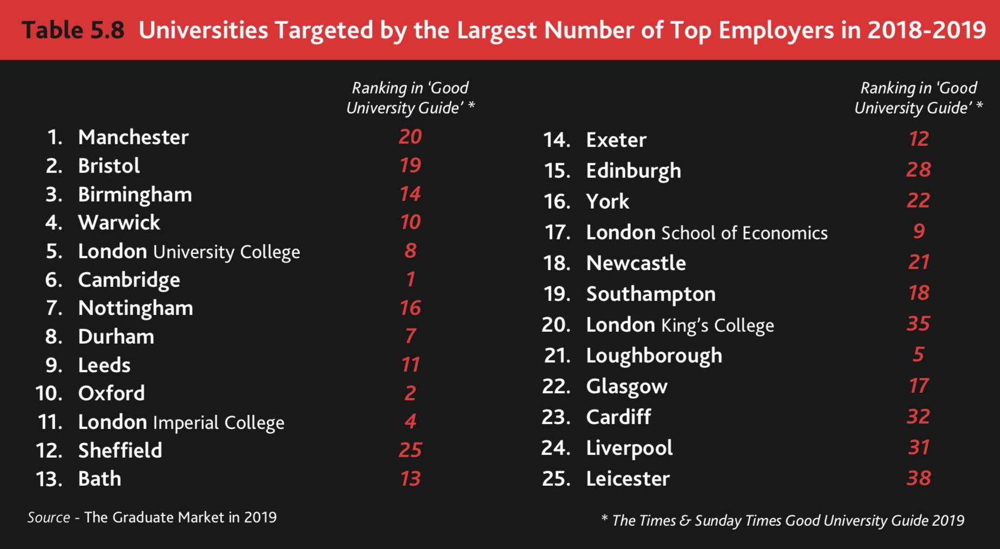

# Employers {#employers}

We work with a wide range of employers from the smallest bedroom startup to the worlds largest multi-national corporations, and are always looking for more organisations that can offer our students a stimulating working environment. According to [highfliers.co.uk](https://www.highfliers.co.uk), the University of Manchester is the most targeted University in the UK by the [Times Top 100 Graduate Employers](https://www.top100graduateemployers.com). We can still do better, for example by engaging with a more diverse group of employers, especially those in Manchester and the [Northern Powerhouse](https://northernpowerhouse.gov.uk/) (see [git.io/manc](https://git.io/manc)).

```{r echo = FALSE, fig.align = "center", out.width = "100%"}
knitr::include_graphics("images/industry-club-wide.png")
```

## Recruiting students

If you are recruiting computer scientists and software engineers as a summer interns, placement students or as graduates please get in touch with me or [Mabel Yau](https://uk.linkedin.com/in/mabel-yau) (careers and placements officer). We typically have around 250 undergraduate students graduating annually, alongside a smaller number of Masters and PhD students.

If you are looking to recruit students from related degree disciplines like [Physics](https://www.physics.manchester.ac.uk/), [Maths](https://www.maths.manchester.ac.uk/), [Chemistry](https://www.chemistry.manchester.ac.uk/), [MACE](https://www.mace.manchester.ac.uk/), [Materials](https://www.materials.manchester.ac.uk/) and [EEE](https://www.eee.manchester.ac.uk/) you should talk to the Careers Service centrally at [careers.manchester.ac.uk](http://www.careers.manchester.ac.uk/)

## Careers fairs
Our annual Computer Science careers fair is held in the Kilburn building in autumn, we typically have around 30 employers exhibiting over two days. As space is limited, we are always over-subscribed and are not able to accommodate every employer that are students will be interested in.

If you aren't able to exhibit at our careers fair, we also run drop-in sessions where employers can come in and set up a stand in the foyer to talk to students informally on their way to and from lectures. These usually happen during lunch in [term time](https://www.manchester.ac.uk/discover/key-dates/). If you're interested in exhibiting at either of these events, please [contact the careers and placements officer Mabel Yau][Contact].

The central careers service also organises:  

* the big careers fair in [Manchester Central](https://www.manchestercentral.co.uk/) every autumn, see the [Big Careers Fair](http://www.careers.manchester.ac.uk/events/bigcareersfair/)
* a smaller careers fair in Fallowfield [Armitage centre](http://www.sport.manchester.ac.uk/facilities/armitage/) in May
* hundreds of other employer events on campus during term time

## Industry Club

```{r echo = FALSE, fig.align = "center", out.width = "40%"}
knitr::include_graphics("images/industry-club-black.png")
```

All employers are welcome to join our industry club mailing list by sending an email to listserv@listserv.manchester.ac.uk with the the text **subscribe cs-industryclub yourfirstname yoursecondname** in the body of the email message. The industry club is part of our [wider business engagement activities](https://www.cs.manchester.ac.uk/connect/business-engagement/).

The mailing list is low-traffic, typically two to three updates per year and an invitation to our annual industry club meeting. We promise not to spam you or sell your email details on to third parties.

## The Wednesday Waggle

During term time, we highlight events and vacancies for Computer Science students from a [wide range of sources](http://dullhunk.github.io/where-can-I-look-for-jobs.html) in the [Wednesday Waggle](https://waggle.cs.manchester.ac.uk/waggle/about). If you have vacancies or events you would like our students to know about, [get in touch with us][Contact] or [contact the careers service](http://www.careers.manchester.ac.uk/aboutus/contact/).

## Buzzing! 🐝

At peak times, we can get **very busy** with many concurrent employer events on campus. Please be patient and persistent if we do not reply immediately. Unfortunately, we are not always able to respond to everyone because our students, staff and space are all finite resources. We give priority to employers that have already given their time and expertise to our community.

```{r echo = FALSE, fig.align = "center", out.width = "100%", fig.cap='According to [highfliers.co.uk](https://www.highfliers.co.uk), the University of Manchester is the most targeted University in the UK by the [Times Top 100 Graduate Employers](https://www.top100graduateemployers.com)'}

```
