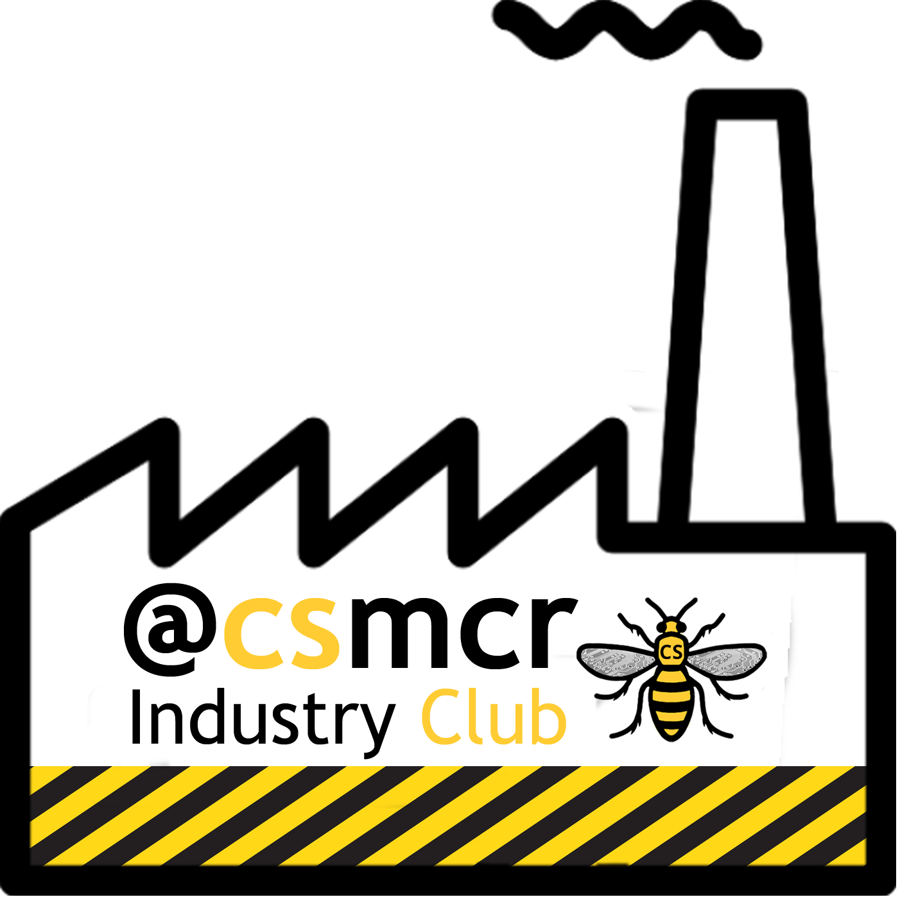
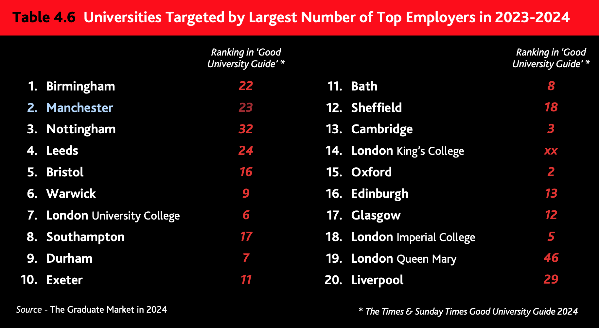

# Employers
We work with a wide range of employers from the smallest bedroom startup to the worlds largest multi-national corporations, and are always looking for more organisations that can offer our students a stimulating working environment. According to [highfliers.co.uk](https://www.highfliers.co.uk), the University of Manchester is the most targeted University in the UK by the [Times Top 100 Graduate Employers](https://www.top100graduateemployers.com). [@times100; @highfliers2021; @highfliers2020; @Birchall2019] We can still do better, for example by engaging with a more diverse group of employers, especially those in Manchester and the [Northern Powerhouse](https://northernpowerhouse.gov.uk/), see [git.io/manc](https://git.io/manc). [@gitmanc; @londonvstherest; @hebdenbridge; @manhattanchester; @manchattan]

```{r echo = FALSE, fig.align = "center", out.width = "100%", fig.cap = "Any employer recruiting our students is welcome to join our industry club, see details below"}
knitr::include_graphics("images/industry-club-wide.png")
```

## Recruiting students {#recruiting}

If you are recruiting computer scientists and software engineers as a summer interns, placement students or as graduates please get in touch with me or [Mabel Yau](https://uk.linkedin.com/in/mabel-yau) (careers and placements officer). We typically have around 250 undergraduate students graduating annually, alongside a smaller number of Masters and PhD students. The [entry tariff](https://www.ucas.com/ucas/tariff-calculator) of our students (A* A* A* including mathematics) is comparable to other leading Computer Science (CS) departments in [Russell Group](https://en.wikipedia.org/wiki/Russell_Group) universities as shown in the table below.


Institute | UCAS entry tariff  
----------- | ----------- | --------
[University of Manchester](https://www.manchester.ac.uk/study/undergraduate/courses/2019/00560/bsc-computer-science/) | A* A* A*
[University of Cambridge](https://www.undergraduate.study.cam.ac.uk/courses/computer-science) | A* A* A
[University College London](https://www.ucl.ac.uk/prospective-students/undergraduate/degrees/computer-science-bsc/2020)| A* A* A
[Imperial College London](https://www.imperial.ac.uk/computing/prospective-students/courses/ug/beng-meng-computing/) | A* A* A
[University of Oxford](https://www.ox.ac.uk/admissions/undergraduate/courses-listing/computer-science) | A* A A

<!--
| CS Students per year
| ~100
| ~150
| ~200
| ~250
| ~50-->


If you are looking to recruit science and engineering students from other disciplines like [Physics](https://www.physics.manchester.ac.uk/), [Maths](https://www.maths.manchester.ac.uk/), [Chemistry](https://www.chemistry.manchester.ac.uk/), Mechnical, Aerospace & Civil Engineering ([MACE](https://www.mace.manchester.ac.uk/)), [Materials Science](https://www.materials.manchester.ac.uk/) and Electrical & Electronic Engineering ([EEE](https://www.eee.manchester.ac.uk/)) you should talk to:  

* academic staff in those departments and/or  
* the central careers service of the University via [employers.manchester.ac.uk](http://www.employers.manchester.ac.uk/)

<!--UPDATE THIS: A demographic breakdown of our students in Computer Science is show in Figure fig:pie-fig-->

## Careers fairs {#careersfairs}
Our annual Computer Science careers fair is held in the Kilburn building in autumn, we typically have around 30 employers exhibiting over two days. As space is limited, we are always over-subscribed and are not able to accommodate every employer that our students will be interested in. We give priority to employers that offer internships, placements and graduate roles and have contributed to our community through the activities described on this page. The central careers service also organises:  

* the big careers fair every autumn, see the [events](https://www.careers.manchester.ac.uk/events/)
* a smaller careers fair in May
* hundreds of other employer events on campus during term time [@highfliers2020]

## Drop-in sessions {#dropins}
If you aren't willing or able to exhibit at careers fairs, we also run ad-hoc drop-in sessions where employers can come in and set up a stand in the foyer to talk to computer science students informally on their way to and from lectures. These usually happen during lunch in [term time](https://www.manchester.ac.uk/discover/key-dates/). If you're interested in exhibiting at either of these events, please [contact the careers and placements officer Mabel Yau](#office).

## Industry Club {#industryclub}

```{r echo = FALSE, fig.align = "center", out.width = "40%"}

```

All employers are welcome to join our industry club mailing list by sending an email to listserv@listserv.manchester.ac.uk with the the text **subscribe cs-industryclub yourfirstname yoursecondname** in the body of the email message. The industry club is part of our [wider business engagement activities](https://www.cs.manchester.ac.uk/connect/business-engagement/).

The mailing list is low-traffic, typically two to three updates per year and an invitation to our annual industry club meeting. We promise not to spam you or sell your email details on to third parties.

## Industrial mentoring {#mentoring}
The [Industrial mentoring scheme for software engineers](https://www.cs.manchester.ac.uk/connect/business-engagement/industrial-mentoring/) allows employers meet students during code review sessions.

## Co-supervised projects {#cosupervise}
If you would like to co-supervise a project student in collaboration with an academic member of staff, there are several options. The best option depends on the domain, level and duration of the project:

* **Bachelors projects**: these are completed in the final year of a Bachelors degree and last for six months, starting in September and finishing in March. Projects are proposed (and offered to students) in March and start in September of the same year.
* **Masters projects**: again these are six months in duration but start in March and finish in September. Projects are proposed (and offered to students) in the preceding November.
* **PhD projects**: For industrially sponsored or co-supervised projects, speak to the research office at [cs.manchester.ac.uk/research](https://www.cs.manchester.ac.uk/research/).
* **Knowledge Transfer Partnerships**: We have a range of [KTPs](https://www.gov.uk/guidance/knowledge-transfer-partnerships-what-they-are-and-how-to-apply), speak to the research office for details
* **Impact Acceleration Accounts**: We have a range of [IAAs](https://epsrc.ukri.org/innovation/fundingforimpact/impact-acceleration-accounts/), speak to the research office for details

For Bachelors and Masters projects, you can contact academic members of staff directly, or speak to [Terence Morley](https://research.manchester.ac.uk/en/persons/terence.morley) (final year project lead) or [Thomas Thomson](https://research.manchester.ac.uk/en/persons/thomas.thomson), who leads our postgraduate taught (Masters) courses.

<!-- give an example project template -->


## The Wednesday Waggle

During term time, we highlight events and vacancies for Computer Science students from a [wide range of sources](https://www.cdyf.me/finding) in a weekly newsletter called the *Wednesday Waggle* ([waggle.cs.manchester.ac.uk](https://waggle.cs.manchester.ac.uk/waggle/about)) 🐝. This goes out to around ~1500 Bachelors and Masters Computer Science students in Manchester each week. If you have vacancies or events you would like our students to know about, you can advertise them at [careerconnect.manchester.ac.uk](https://careerconnect.manchester.ac.uk/), and let me know when they are live in the system, then I can highlight them to the weekly newsletter. Alternatively, point us to where they are advertised online, see [advertising vacancies to students](https://www.cdyf.me/finding#studentjobs). It can help students find your needle in the jobs haystack.

## Join the community

There is a thriving community of engineers and [entrepreneurs](https://www.accelerateme.co/) in Manchester and across the North of England. One of the best ways to recruit engineers and scientists is to join and _contribute_ to the community. Get involved in events, [sponsor a hackathon](https://www.unicsmcr.com/), deliver a guest lecture, host your own event or [become a software engineering mentor](https://www.cs.manchester.ac.uk/connect/business-engagement/industrial-mentoring/). Employers who engage **early and often** are much more likely to get something back. As an employer, you may also be interested in events run by:

* The [Institute of Student Employers](https://ise.org.uk/) (ISE)
* The [Association of Graduate Careers Advisory Services](https://www.agcas.org.uk) (AGCAS)
* The [Work Based and Placement Learning Association](https://www.asetonline.org) (ASET)

If you're a startup new to employment, you may find the guide at [gov.uk/employ-someone](https://www.gov.uk/employ-someone) useful.

## Buzzing!

At peak times, we can get **very busy** with many concurrent employer events on campus, see figure \@ref(fig:busy-fig). Please be patient and persistent if we do not reply immediately. Unfortunately, we are not always able to respond to everyone because our students, staff and space are all finite resources. We give priority to employers that have already given their time and expertise to our community.

(ref:captionhighfliers) According to [highfliers.co.uk](https://www.highfliers.co.uk), the University of Manchester is the second most targeted University in the UK by the [Times Top 100 Graduate Employers](https://www.top100graduateemployers.com) [@highfliers2024]

```{r busy-fig, echo = FALSE, fig.align = "center", out.width = "100%", fig.cap='(ref:captionhighfliers)'}

```

## Employability
We are working hard to improve the employability of students because while having a Computer Science is necessary for some jobs, it is not sufficient. [@unemployed; @shadboltreview; @fincherreview; @finchergecco] Over the last decade we have been successful in *more than doubling* the number of our students going on year long placements in industry to around 100 per year, see figure \@ref(fig:ie-fig). This is a win-win-win situation for:

1. **Students**: benefit from a broader education, and develop social and non-cognitive skills that can be challenging to teach and learn in a purely academic environment. This is known as the [winning personality](https://www.suttontrust.com/research-paper/a-winning-personality-confidence-aspirations-social-mobility/) [@winningpersonality].
2. **Employers**: placements are a cost-effective way for employers to recruit (and retain) graduate talent
3. **Universities**: produce better graduates [@Mandilaras2004] with broader and deeper skills, who earn more and get better jobs [@winningpersonality]. Well paid placements can also facilitate social mobility. [@Wang2018]


```{r ie-fig, echo = FALSE, results='hide', message=FALSE, warning=FALSE, fig.align = "center", out.width = "100%", fig.cap = "(ref:ieblurb)"}

library(tidyverse)
library(ggplot2)

evenmoarplacements <- readr::read_csv("https://raw.githubusercontent.com/dullhunk/cdyf/master/data/onie.csv")


ggplot(data = evenmoarplacements) + geom_bar(mapping = aes(x = year, y = students), stat = "identity")
```

(ref:ieblurb) Number of undergraduate Computer Science students completing a year in industry as part of their degree at the University of Manchester. Since 2008 over 900 students have completed the program. I have been leading the program since 2012 and managed to ~double the number of students doing placements per year. As you can see in the histogram, the COVID-19 pandemic started having an effect on students starting placements in 2020.


Previously our students have secured year long placements at a wide range of employers including Accenture, Agilent Technologies, Amazon, AND Digital, Apadmi, Arggo, ARM, Autodesk, AVL Powertrain, BAML, the BBC, Biorelate, BJSS, Bloomberg, BMW Mini, Bsquare Controls, BT, Cantarus, Celtra, CERN, Codethink, d3t, Elysian Systems, Feral Interactive, Fidelity, FiveAI, HMRC, IBM, Imagination Technologies, Intel, ISA Software, JP Morgan, Keysight Technologies, KPMG, Matillion, McAfee, Mentor Graphics, Monoprix, Morgan Stanley, NCC Group, Nokia, Nomura, Novacoast, Ocado, PA Consulting, PwC, Schlumberger, ServiceNow, Siemens, Soda Software, SteamaCo, The Hut Group, The Start Up Factory, Uber, Visa and Vodafone.

There's still more we can do to improve the employability of our graduates. If you'd like to help our graduates become more employable, [get in touch](contact).

<!--
## Guest lectures from employers {#guestlectures}

The Department of Computer Science welcomes external speakers and hosts a number of guest lectures from a wide range of collaborators in industry and academia. There are several ways the department can host guest lectures

* Scheduled lectures for [COMP101](https://studentnet.cs.manchester.ac.uk/ugt/COMP10120/syllabus/), a first year course with 400+ enrolled students. During 2021, these talks take place on Mondays from midday to 12.50pm on zoom
* School research seminars , see [examples of past seminars](https://www.cs.manchester.ac.uk/connect/events/past-events/)
* Technical talks arranged as part of a scheduled course, speak to the [course leader for the relevant course](https://www.cs.manchester.ac.uk/about/people/). These tend to be more advanced courses aimed at students later in their degrees or as part of postgraduate study.
* One-off talks arranged *ad hoc* that are not part of scheduled series of lectures
* Seminars and talks from speakers arranged and booked by students, for example [unicsmcr.com](https://unicsmcr.com/), The University of Manchester Computer Science society

### Examples of COMP101 lectures

Some example guest lectures for COMP101 are shown below to give a flavour of the kind of talks that are appropriate

* Hacking the Hacks, delivered by NCC Group
* Debunking the myths associated with User Experience, delivered by American Express
* The Business of Intellectual Property, delivered by Imagination Technology)
* How to Break a Hacker's Mind, Web Application Vulnerabilities Exposed, delivered by Morgan Stanley
* 100 billion ARM chips, delivered by ARM
* Software at Airbus
* Computing in the Community, delivered by CodeClub & Manchester Girl Geeks
* How to be a brilliant software engineer, delivered by Apadmi


### Interested in speaking?
For COMP101, we are always looking for good speakers who can engage large groups of students on interesting topics that they care about and relate to Computer Science. For COMP101, there are a limited number of guest lecture slots (around 20) which run through term-time starting in November and finishing in early June. Its important that speakers

* Give much more than a sales pitch for an organisation, by providing insight into a technical subject
* Talk about content that relates to the (very broad) syllabus of COMP101
* Engage, interact, educate and entertain. Students vote with their feet (by not turning up) if they think a lecture won't be interesting
* If you would like to propose a guest lecture for COMP101, please contact Duncan Hull. For all other external seminars and events, see the links above.

Since lockdown, lectures have been online, which has allowed for more interaction, typically via the chat dialogue. We can monitor and moderate the chat, feeding questions to the speaker when it's appropriate.-->
