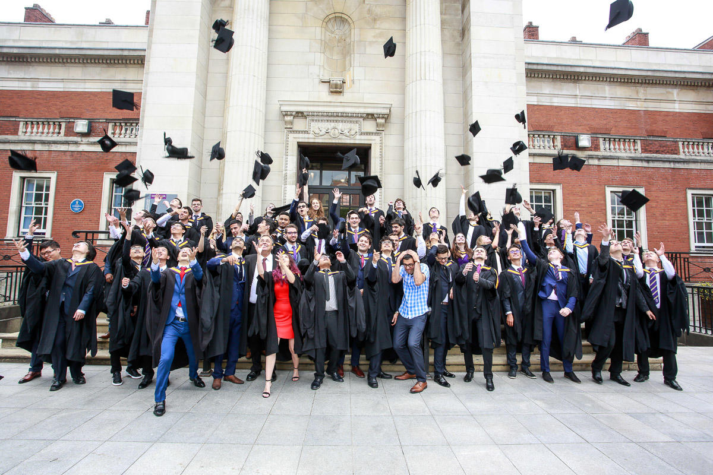

# Employing Your Future {#employers}
If you are an employer, graduates and undergraduates are an important part of the future of your organisation. Collaborating with us in the Department of Computer Science is one of the best ways to encourage students from the University of Manchester to join your organisation as employees both before and after they graduate, see figure \@ref(fig:graduating-your-fig).

```{r graduating-your-fig, echo = FALSE, fig.align = "center", out.width = "100%", fig.cap = "(ref:captiongradceremony)"}

```

(ref:captiongradceremony) Are these graduates the future of your organisation? If you want them to be, you need to engage early and often with students *before* they graduate. This will increase your chances of recruiting them. University of Manchester graduates celebrating their graduation outside the [Samuel Alexander](https://en.wikipedia.org/wiki/Samuel_Alexander) building with photobombing by [Gavin Brown](https://profgavinbrown.github.io/) 🎓

If you're not recruiting graduates, your organisation may suffer in the longer term as talented and young employees decide to work for other employers. Recruiting graduates is a cost effective way to build the skills and knowledge your organisation needs to succeed in the future. Find out more in our industry club pages at [industry-club.cs.manchester.ac.uk](https://industry-club.cs.manchester.ac.uk/)

<!--

Institute | UCAS entry tariff  
----------- | ----------- | --------
[University of Manchester](https://www.manchester.ac.uk/study/undergraduate/courses/2024/00560/bsc-computer-science/course-details/) | A* A* A* -->


<!--
## Drop-in Sessions {#dropins}
If you aren't willing or able to exhibit at careers fairs, we also run ad-hoc drop-in sessions where employers can come in and set up a stand in the foyer to talk to computer science students informally on their way to and from lectures. These usually happen during lunch in [term time](https://www.manchester.ac.uk/discover/key-dates/). If you're interested in exhibiting at either of these events, please [contact the careers and placements officer Mabel Yau](#office).-->


<!--Previously our students have secured year long placements at a wide range of employers including Accenture, Agilent Technologies, Amazon, AND Digital, Apadmi, Arggo, ARM, Autodesk, AVL Powertrain, BAML, the BBC, Biorelate, BJSS, Bloomberg, BMW Mini, Bsquare Controls, BT, Cantarus, Celtra, CERN, Codethink, d3t, Elysian Systems, Feral Interactive, Fidelity, FiveAI, HMRC, IBM, Imagination Technologies, Intel, ISA Software, JP Morgan, Keysight Technologies, KPMG, Matillion, McAfee, Mentor Graphics, Monoprix, Morgan Stanley, NCC Group, Nokia, Nomura, Novacoast, Ocado, PA Consulting, PwC, Schlumberger, ServiceNow, Siemens, Soda Software, SteamaCo, The Hut Group, The Start Up Factory, Uber, Visa and Vodafone.-->

