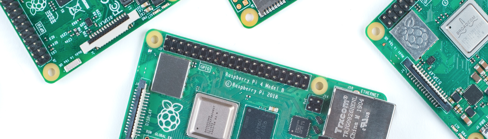
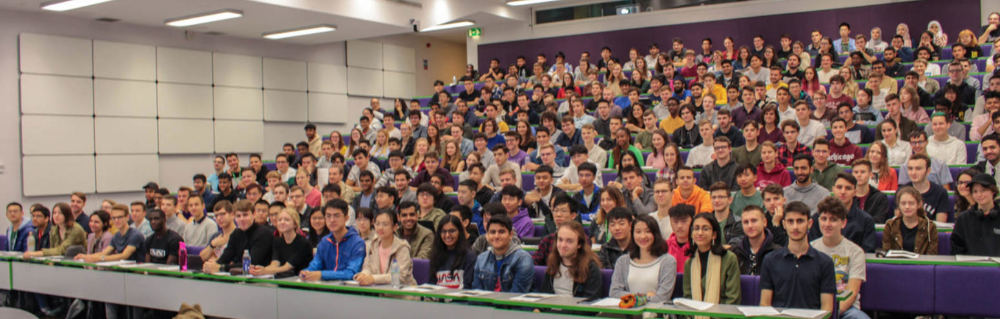

# Coding their future {#coding-their-future}

Coding their future is a collaboration & partnership between secondary schools and the [Department of Computer Science](https://www.cs.manchester.ac.uk/) at the University of Manchester. Our aims are to:

* improve and support Computer Science education at key stages 3, 4 and 5. [@shutdownrestart; @afterthereboot; @cse; @cambridgegcse]
* [widen participation in higher education](https://www.manchester.ac.uk/discover/social-responsibility/widening-participation/), especially in under-represented groups. [@wideningparticipation; @classceiling; @nicebutdim; @breakintoelite]
* enable our undergraduate students to develop their leadership and communication skills

(ref:captioncodingtheirfuture) Undergraduate students in computer science regularly work with schools as part of our wider [social responsibility activities](https://www.cs.manchester.ac.uk/connect/social-responsibility/) [@m2020; @m20202] and [schools, colleges and public activities](https://www.cs.manchester.ac.uk/connect/schools-colleges-public/)

```{r echo = FALSE, fig.align = "center", out.width = "98%", fig.cap = "(ref:captioncodingtheirfuture)"}
knitr::include_graphics("images/schools-banner.jpg")
```
The University provides schools with a final year student who can teach Computer Science in your school or college as a teaching assistant (TA). In return, the school provides our undergraduate students with a safe and supportive environment in which to teach which extends and augments your current curriculum. This can either be an after school, extension / lunchtime club or during scheduled lesson time, typically between year 7 and 13. This is similar to the [Undergraduate Ambassador Scheme](https://en.wikipedia.org/wiki/Undergraduate_Ambassadors_Scheme) (UAS), [@uas; @Cooper2005] and school placements [@Moller2019] except students work is assessed using our final year project framework. [@COMP30030; @COMP30040] Since these projects were started in 2012, our students have worked with a range of schools in the private and public sector, both selective and non-selective, co-educational and single-sex including:

* [Fairfield High School for Girls](http://www.fairfieldhigh.tameside.sch.uk/), Droylsden
* [Trinity CofE High School](https://www.trinityhigh.com), Central Manchester
* [University Technical College (UTC) $@$MediaCityUK](http://www.utcmediacityuk.org.uk/), Salford
* [Manchester Communication Academy](https://www.manchestercommunicationacademy.com/), Harpurhey  
* [The Barlow RC High School](https://thebarlowrchigh.co.uk/), Didsbury
* [William Hulme Grammar School](https://www.whgs-academy.org/), Whalley Range
* [Cheadle Hulme High School](https://www.chhs.org.uk/), (CHHS) Stockport
* [Laurus Cheadle Hulme](https://www.lauruscheadlehulme.org.uk/), Stockport
* [Knutsford Academy](https://www.knutsfordacademy.org.uk/), Knutsford
* [Altrincham Grammar School for Girls](http://www.aggs.trafford.sch.uk/), Trafford
* [Altrincham Grammar School for Boys](https://www.agsb.co.uk/), Trafford
* [Manchester Grammar School](https://www.mgs.org/) (MGS), Fallowfield
* [Stretford Grammar](https://www.stretfordgrammar.com/) (SGS), Stretford

The projects were setup by [Duncan Hull][Contact] and [David Rydeheard](http://www.cs.man.ac.uk/~david/) (who retired in 2019), and are now run and supervised by Duncan. We hope to transfer ideas between private and public sector, as there are lots of open questions about how Computer Science should be taught. [@cse; @suemcr; @stephenson; @fincherpetre] To find out more, see the [guidance for teachers] and [guidance for students] below.

## Guidance for teachers

(ref:captionraspberrypi) An abundance of free software and relatively cheap new hardware like the [Raspberry Pi](https://www.raspberrypi.org) [@raspberrypi], [Microbit](https://microbit.org), [@Sentance2017] [Makey Makey](https://makeymakey.com) [@nevertooold; @makeymakey;] [Crumble Controller](https://redfernelectronics.co.uk/crumble/) and [Arduino](https://www.arduino.cc) [@arduino] has opened up lots of new possibilities for teaching Computer Science. Picture via Alex Bate. [@SnazzyRPi])

```{r echo = FALSE, fig.align = "center", out.width = "98%", fig.cap="(ref:captionraspberrypi)"}

```

Our aim is to support the teaching and learning of Computer Science in your school and to help engage schoolchildren in the subject. This page describes what we can provide you with and what we expect to get in return.

### What the University is offering your school

The University of Manchester will provide your school or college with at least one student ambassador with some relevant training who has completed two years of study in Computer Science and has:

* A good knowledge of, and enthusiasm for Computer Science
* Completed [Disclosure and Barring Service](https://www.gov.uk/government/organisations/disclosure-and-barring-service) (DBS) clearance
* An interest in teaching and working with young people
* Achieved a minimum of a 2:1 or 1st class degree in their second year

### What the University expects from your school

In return, we expect that the school provides the undergraduate student with:

* Opportunities to engage with a classroom or after school club of children as a Teaching Assistant (TA). This is typically for around one or two hours during term time. Initially, this could be through classroom observation and teacher assistance, culminating in the student delivering at least one lesson (and potentially a series of lessons) with your support and guidance
* Advice, suggestions, feedback, assessment and encouragement from you to suggest the kinds of resources that would be useful, appropriate or engaging for the Computer Science curriculum you are teaching
* Classroom and behaviour management: the students are not trained teachers and will be relying on your expertise in classroom and behaviour management.

### Resources developed by students

Undergraduates typically develop a range of resources. The project will involve development of a computer-based system together with supporting activities, lessons and resources. The resource could be a variety of things including, a game, robotics, animations, hardware (Raspberry Pi, Arduino etc) or software, intended to enthuse school students at one of the Key stages 3 or 4 about fundamental concepts in computing preferably linked to one of the new Computer Science curricula.

### Project timing

The projects run for 6 months from September to March, divided into three phases.

1. **September to October**  Observation in the classroom teaching by the student around once per week. Development of ideas for an educational tool that the student will make, with the advice of the classroom teacher
2. **November to January** From November to January, our students develop and tests prototype tool (or tools) with the supporting material, this can happen sooner for students who make a quick start to the project.
3. **February to April**  From February to April, our students are expected to liaise closely with teachers to develop an educational tool that will be of use in the classroom using teachers' suggestions as to what is appropriate to build. Students will spend some time in a classroom working closely with teachers and students developing and delivering a new resource for teaching. More details on final year projects can be found in COMP300, the undergraduates already know what is required from their project

### Assessment and monitoring

Formal supervision and mentoring is undertaken by the university (Duncan and David), but we will ask you to fill in a one page form on your assessment of their progress during their time at your school, we very much value your input and hope that these projects can beneficial for both your school and the University. We don’t want to burden you with unnecessary bureaucracy that all teachers battle with!

## Guidance for students

```{r echo = FALSE, fig.align = "center", out.width = "98%", fig.cap = "Lecture theatre 1.1 (LT 1.1) in Kilburn full of first year students"}

```

So why would you, an undergraduate student, want to work on an education project in secondary school? The UK government would like Computer Science should be taught in all secondary schools in the UK. [@afterthereboot] However, in many UK schools there is a shortage of teachers who are trained in Computer Science, consequently, many teachers find themselves being asked to teach a subject they may know little about. [@shutdownrestart]

Undergraduate students can make a significant difference here, by supporting teachers in the classroom to create and deliver new classroom resources in Computer Science. [@computinged] In addition, undergraduate students  will have the chance to:

* develop leadership skills in the classroom
* gain valuable experience of working on “real world” problems in a stimulating environment
* improve your communication skills, especially spoken communication
work as part of a team (in the school) and join a small group of like-minded undergraduate students (in the University) working on related projects
* test your knowledge & technical ability in a challenging and dynamic environment working with young people
* last, but not least, there is a good chance you will have lots of fun and have a rewarding experience of teaching
make yourself more employable by doing all of the above

### Who is involved?

Initially, the number of undergraduate students involved in these projects will be less than ten. We also require that you will have a minimum of a 2:1 or 1st in your second year exams. Projects are co-supervised by Duncan with additional supervision from an experienced member of teaching staff at a participating school.

We have carefully selected schools in Manchester that are relatively easy for you to get to, are already teaching Computer Science and have supportive staff and teachers in place to help you. You will be expected to work directly with school children with the support of the teaching staff in your school. Schools we have worked with are all the Manchester area.

### What will the educational projects be expected to deliver?

You will be expected to work closely with the teacher to develop resources that

* engage students with one or more aspects of the new Computer Science curriculum at an appropriate key stage. This is usually [key stage 3](https://en.wikipedia.org/wiki/Key_Stage_3), [key stage 4](https://en.wikipedia.org/wiki/Key_Stage_4) or [key stage 5](https://en.wikipedia.org/wiki/Key_Stage_5) ages 11-18.
* complement **and extend** the schools current provision for computer science in the school

During the project you will be spending a significant amount of time in the classroom, visiting your school every week during school term time throughout the duration of your project to develop resources. These must include a computer-based teaching tool which may use, for example, Raspberry Pi’s, visual aids, demonstrations, videos, online questionnaires, formative feedback, games, drones, robotics, music, [@Aaron2016] algorithms [@Kubica2012] or even just the command line [@conquerthecommandline] etc.^[Conquer the command line is part of the The MagPi essentials series, there are lots of others like it you may find useful on using the camera module, gaming in python, simple electronics and more at https://store.rpipress.cc] In addition, guidance on classroom use, such as a lesson or series of lessons to support the tool. Remember that you don't actually need a computer, see [Computer Science Unplugged](https://csunplugged.org): Computer Science without a Computer. [@Bell2018]

All deliverables for standard final year projects will be expected of these projects including:

* first semester presentation
* demonstration of the resource being used in the classroom
* final written report

Assessments for these projects will be as for standard projects, [@COMP30030; @COMP30040] but part of the evaluation of the project will be a classroom demonstration, a description and evaluation of which should be included in your final report.

### Blended learning {#blended}
COVID 19 has changed teaching, from primary and secondary school right through to higher education. You need to get clued up on [blended learning](https://en.wikipedia.org/wiki/Blended_learning). Start with [Moving to Blended Learning, Part 1: Terminology and Concepts](http://www.elearning.fse.manchester.ac.uk/fseta/moving-to-blended-learning-part-1-terminology-and-concepts/), then take a look the video below with Steve Pettifer explaining techniques for slides that work for blended learning videos:


```{r srp-fig, echo = FALSE, fig.align = "center", out.width = "99%", fig.cap = "(ref:srp)"}
knitr::include_url('https://www.youtube.com/embed/Y50mTVIzAYk')
```

(ref:srp) If you're making presentations for students to watch before or after your lessons, its worth spending some time thinking about how to make your slides video friendly. You can also watch the full 7 minute video embedded in this figure at [youtu.be/Y50mTVIzAYk](https://youtu.be/Y50mTVIzAYk) [@youtube-srp]


When you teach, think about how you can support students before and after your time in the classroom.

### When do the projects start and finish? {#finishing}

Projects start annually in September and are handed at Easter time, see final year project guidelines. For more information contact [Duncan Hull](#Contact).

## Getting a head start
So you've selected *Coding their future* as your third year project and now you are ready to get started. There are plenty of resources to help you prepare and improve your effectiveness in the classroom.

* **Work with young people**
   + Any experience of working with young people will be beneficial, if you have the time and opportunity over the summer you can get some experience of working with young people for example through [codeclub.org](https://codeclub.org/) and [coderdojo.com](https://coderdojo.com/). If you're in Manchester over the summer, see [mcrcoderdojo.org.uk](https://mcrcoderdojo.org.uk/) which meets every month at the Manchester Technology Centre on Oxford Road, they are always looking for new volunteers.
   + It doesn't have to be coding either, you could get involved with any activities such as sporting events or others, see [find-volunteering.manchester.ac.uk](https://find-volunteering.manchester.ac.uk/)
* **Read around** There are lots of really good articles and books to help you, I recommend you start with:
    + *Teaching Computing* [@teachingcomputing] by Carl Simmons & Claire Hawkins, is aimed at teachers of computing, particularly trainee computer science teachers. [e-book available here, University of Manchester login required](http://dx.doi.org.manchester.idm.oclc.org/10.4135/9781473919785)
    + *Computer Science Education* [@cse] edited by [Sue Sentance](https://en.wikipedia.org/wiki/Sue_Sentance), Erik Barendsen and Carsten Schulte. Only available in print form, useful for reference
    * *The Cambridge Handbook of Computing Education Research* edited by Sally Fincher and Antony V. Robins [@CERhandbook], electronic copies available at [doi.org/gb5d](https://doi.org/gb5d) (UoM login required) this is a comprehensive overview of the field, useful for reference
    * *Hello World* magazine, see [helloworld.raspberrypi.org](https://helloworld.raspberrypi.org/) is packed full of ideas for teaching computing (and its free too)
    * *Quick Reads* give short two page introductions to teaching computing, see [blog.teachcomputing.org/tag/quickread](https://blog.teachcomputing.org/tag/quickread/)
* **Do some courses** there are lots of free Open University courses to get prepared for teaching:
    + Impact of Technology: How To Lead Classroom Discussions. Learn how to keep 14-16 year-old students engaged in discussions while teaching computer science. Supported by Google [futurelearn.com/courses/impact-of-technology](https://www.futurelearn.com/courses/impact-of-technology)
    + Teaching Physical Computing with Raspberry Pi and Python [futurelearn.com/courses/physical-computing-raspberry-pi-python](https://www.futurelearn.com/courses/physical-computing-raspberry-pi-python)
    + Since some of your teaching is likely to be asynchronous, you would also benefit from having a look at [taking your teaching online](https://www.open.edu/openlearn/education-development/education/take-your-teaching-online/content-section-overview) from OpenLearn
    + Many more Teaching Computing Courses at [futurelearn.com/subjects/teaching-courses/teaching-computing](https://www.futurelearn.com/subjects/teaching-courses/teaching-computing)
* **Join the community** The UK Special Interest Group (SIG) on Computer Science Education (CSE) has monthly events listed online at [uki-sigcse.acm.org/events](https://uki-sigcse.acm.org/events), these cover computing events from primary through to secondary and higher education
