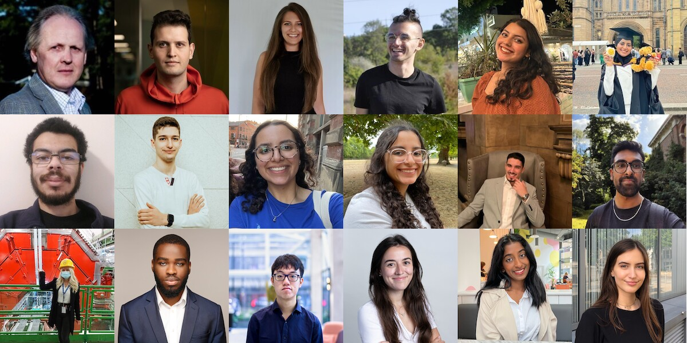

# Hearing Your Future {#hearing-your-future}

*Hearing Your Future* is a podcast which accompanies the Coding Your Future guidebook. We talk to [graduands](https://en.wiktionary.org/wiki/graduand) and graduates of computer science, see figure \@ref(fig:collage-fig), to hear more about their journey from student to professional. As part of their exit interview we ask them what happens after graduation? What comes next?

```{r collage-fig, echo = FALSE, fig.align = "center", out.width = "100%", fig.cap = "(ref:captioncollage)"}

```

(ref:captioncollage) Some recent guests on the podcast. Collage of pictures re-used from LinkedIn and Github with permission. From left to right, top to bottom: [Steve](https://www.cdyf.me/steve), [Cristian](https://www.cdyf.me/cristian), [Stefania](https://www.cdyf.me/stefania), [Bozhidar](https://www.cdyf.me/bozhidar), [Eman](https://www.cdyf.me/eman), [Asma](https://www.cdyf.me/asma), [Jonathan](https://www.cdyf.me/jonathan), [Ivo](https://www.cdyf.me/ivo), [Ingy](https://www.cdyf.me/ingy), [Nadine](https://www.cdyf.me/nadine), [Pedro](https://www.cdyf.me/pedro), [Amish](https://www.cdyf.me/amish), [Raluca](https://www.cdyf.me/raluca), [Jason](https://www.cdyf.me/jason), [Brian](https://www.cdyf.me/brian), [Carmen](https://www.cdyf.me/carmen), [Sneha](https://www.cdyf.me/sneha) and [Alice](https://www.cdyf.me/alice). Thanks again to all our guests for telling us your stories on *Hearing Your Future*, the Coding Your Future podcast. 🎧

## From student to professional {#pro}

Listen in to the episodes below, or read the transcripts, to find out more about how these students are coding their future:

* What's their story?  
* How did they get to where they are?
* What obstacles have they faced and how did they overcome them?
* What advice would they offer to their former selves and fellow students?
* Where are they planning to go next?

<!-- this the trailer -->
```{r, eval=knitr::is_html_output(excludes="epub"), results='asis', echo=FALSE}
cat('<iframe title="Libsyn Player" style="border: none" src="https://html5-player.libsyn.com/embed/episode/id/23577479/height/90/theme/custom/thumbnail/yes/direction/forward/render-playlist/no/custom-color/000000/" height="90" width="100%" scrolling="no"  allowfullscreen="" webkitallowfullscreen="true" mozallowfullscreen="true" allowfullscreen="true" msallowfullscreen="true" style="border: none;"></iframe>')
```
Find out more by listening here or subscribing wherever you get your podcasts. 

Your future is bright, your future needs hearing, so let's start hearing your future.

## Subscribing to your future {#subscribing}

You can subscribe (for free!) by following one of the links below to your favourite podcast tool. Alternatively you can search for `Coding Your Future` or `Hearing Your Future` in your podcast application. You will see the logo shown in figure \@ref(fig:hearing-fig) when you find it.

* Apple: [apple.co/3JFV5Qe](https://apple.co/3JFV5Qe)
* Spotify: [spoti.fi/3SFqaYk](https://spoti.fi/3SFqaYk)
* Amazon: [amzn.to/3OOaS0G](https://amzn.to/3OOaS0G)
* Google: [music.youtube.com/podcasts](https://music.youtube.com/podcasts) (appearing shorlty)
* Deezer: [deezer.com/en/show/3839607](https://www.deezer.com/en/show/3839607)
* Libsyn: [codingyourfuture.libsyn.com](https://codingyourfuture.libsyn.com/)

If all else fails, you can cut-and-paste the raw `rss` feed URL below into the relevant settings on your podcast app:

```md
http://feeds.libsyn.com/299189/rss
```

```{r hearing-fig, echo = FALSE, fig.show = "hold", out.width = "33%", fig.cap = "(ref:captionhearing)"}
knitr::include_graphics(rep("images/Hearing-your-future.png", 3))
```

(ref:captionhearing) *Hearing your future* is the Coding your Future podcast. Subscribe and listen wherever you get your podcasts, see section \@ref(subscribing). Hearing sketch by [Visual Thinkery](https://visualthinkery.com/) is licensed under [CC-BY-ND](https://creativecommons.org/licenses/by-nd/4.0/)


