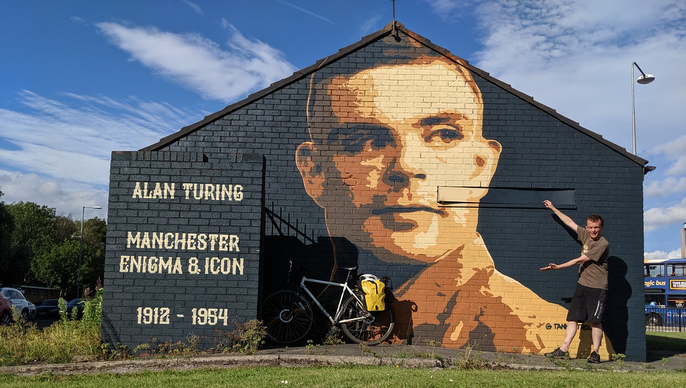

# Contact

You can contact us using the details below, which include directions and parking information.

```{r echo = FALSE, fig.align = "center", fig.cap = "Paying homage to [Alan Turing](https://en.wikipedia.org/wiki/Alan_Turing) at a mural on the [Princess Parkway](https://en.wikipedia.org/wiki/A5103_road) by [tankpetrol.com](http://tankpetrol.com/). Turing is, as [Jonathan Swinton](https://www.manturing.net/jonathan) puts it, the “patron saint of Manchester” [@manturing]. As a [Manchester icon](https://en.wikipedia.org/wiki/Symbols_of_Manchester), he is commemorated locally by the [Alan Turing building](https://en.wikipedia.org/wiki/Alan_Turing_Building), the [Alan Turing Memorial](https://en.wikipedia.org/wiki/Alan_Turing_Memorial) and Alan Turing Way [@turingway]", out.width = "100%"}

```

## Office

Our offices are in the Kilburn building, close to the Byte cafe, past the [Student Support Office](https://studentnet.cs.manchester.ac.uk/student-services/) (SSO), through the double doors, down the ramp.

**Dr. Duncan Hull, Lecturer** 👨‍💻

* 🏢 Room LF25, Kilburn Building
* 📥 email:	duncan.hull ATE manchester.ac.uk
* ☎️ telephone:	+44 161 275 6186
* 🌐 [linkedin.com/in/duncanhull](https://uk.linkedin.com/in/duncanhull)

**Mabel Yau, Careers and placements officer** 👩‍💻

* 🏢 Room LF26, Kilburn Building
* 📥 email:	mabel.yau ATE manchester.ac.uk
* ☎️ telephone:	+44 161 275 6140
* 🌐 [linkedin.com/in/mabel-yau](https://uk.linkedin.com/in/mabel-yau)

**Student Support Office ** 👨‍👩‍👧‍👦

* 🏢 Room LF21, Kilburn Building
* 📥 email compsci-sso@manchester.ac.uk
* ☎️ telephone:	+44 161 306 8155

## Elsewhere

You can get in touch via t'internet at:

* Slack: search for "Duncan Hull" or my work email
* Skype: search for "duncanhull"
* Blog: [duncan.hull.name](https://duncan.hull.name)
* Github: [github.com/dullhunk](https://github.com/dullhunk)
* Twitter: [twitter.com/dullhunk](https://twitter.com/dullhunk)

## Postal address

Send post by snail mail 🐌 to :

Dr. Duncan Hull  
Lecturer  
Department of Computer Science  
Kilburn Building  
The University of Manchester  
Oxford Road  
Manchester  
M13 9PL  
[Lancashire](https://duncan.hull.name/2019/07/05/mancashire/) 🌹   

## Kilburn building directions

From the train stations, it takes about 20 minutes to walk from [Manchester Piccadilly](https://www.nationalrail.co.uk/stations_destinations/man.aspx) (MAN) and ten minutes from [Manchester Oxford Road](https://www.nationalrail.co.uk/stations/mco/details.aspx) (MCO). Our official postcode (M13 9PL) takes you to [University Place](http://www.conference.manchester.ac.uk/venues/search/details/?property=10) next door, so you're better of using the [what3words locations](https://www.bbc.co.uk/news/uk-england-49319760) [@what3words] below which are more accurate:

* Google map of the Kilburn building [bit.ly/directions-to-kilburn-building](http://bit.ly/directions-to-kilburn-building)
* There are two ground floor entrances to the Kilburn building, North and South
  + North entrance: [what3words.com/port.museum.rips](https://what3words.com/port.museum.rips)
  + South entrance: [what3words.com/common.wiping.email](https://what3words.com/common.wiping.email)
* There is no formal reception so the best place to meet is [bit.ly/ByteCafe](http://bit.ly/ByteCafe) on the first floor
* See also [cs.manchester.ac.uk/about/maps-and-travel/](https://www.cs.manchester.ac.uk/about/maps-and-travel/)

## Parking

If you are driving, the nearest car parks are:

* **University Car Park B** [Manchester Aquatics Centre Car Park](https://www.ncp.co.uk/find-a-car-park/car-parks/manchester-aquatic-centre-jv/), NCP [M13  9SS](http://maps.google.co.uk/maps?q=M13+9SS)
* **University Car Park D** Booth Street West Car Park, [M15 6AR](http://maps.google.co.uk/maps?q=M15+6AR), access via Higher Cambridge Street
* See [estates.manchester.ac.uk/services/operationalservices/carparking](https://www.estates.manchester.ac.uk/services/operationalservices/carparking/)
