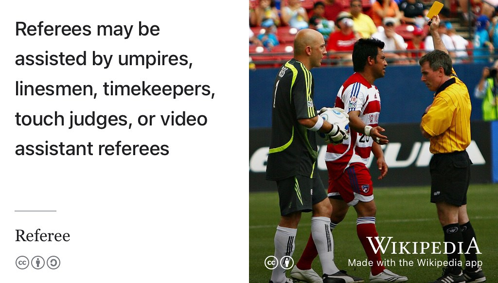

# Refereeing Your Future {#referee}

So, you're a student who needs a reference for a new job or future study?


## “Will you be my referee?” {#willyou}

This is a question academics get asked a lot. As industrial experience and employability tutor, I get asked that question more than most and already write *lots* of references for students applying for jobs and further study, see figure \@ref(fig:referee-fig). 

```{r referee-fig, echo = FALSE, fig.align = "center", out.width = "99%", fig.cap='(ref:captionreferee)'}

```
(ref:captionreferee) Come on ref! I'm not *that* kind of [referee](https://en.wikipedia.org/wiki/Referee), but I *can* provide facts and opinions about you to employers subject to conditions outlined on this page. Whoever your referee is, make sure you ask their permission beforehand, otherwise you may receive an unexpected (virtual) [penalty card](https://en.wikipedia.org/wiki/Penalty_card) from your referee. CC BY image of a referee by Jason Gulledge on Wikimedia Commons [w.wiki/3dqE](https://w.wiki/3dqE) adapted using the [Wikipedia app](https://apps.apple.com/us/app/wikipedia/id324715238) ⚽️

Unfortunately, like yours, my time is a precious and finite resource. So I can write a reference for you if: 

* You have been my personal tutee in first, second, placement or final year
* We have worked together outside of ordinary teaching

It is impossible for me (or any other academic) to say YES to every request for a reference. It is time consuming and difficult for academics to write lots of references for students they don't know much about, as all they can do is confirm facts (attendance, academic marks, degree program) without opinions. This doesn't make for a very compelling reference and can be provided by administrators at the University anyway.

You can obtain an unofficial copy of your transcript by emailing `soe.hub@manchester.ac.uk`. For graduating students, transcripts of marks can be obtained at [man.ac.uk/fQ9otX](http://man.ac.uk/fQ9otX)

Whoever agrees to be your referee, make sure you read and understand the following:

## “Who can provide a reference for me? {#who}

The best person to provide a reference for you is somebody who knows you, such as your personal tutor. See the careers service guide [what are references and how should I choose a referee?](http://www.careers.manchester.ac.uk/applicationsinterviews/faqs/references) and [guidance to staff providing references for students](http://documents.manchester.ac.uk/display.aspx?DocID=1921) from the University of Manchester, which gives extra context.

It is good to have references from different sources, so if you are providing several referees try to pick people from inside and outside the University. Within the University, this is most likely to be your tutor:

* Your personal tutor from year one
* Your personal tutor from year two (if different to first year)
* Your Industrial Experience (IE) tutor (sometimes that's me)
* Your third year project supervisor
* Your Masters project supervisor
* Anyone else who knows you personally

If you ask somebody who does not know you very well to write a reference for you, all that they are able to do in a reference is confirm rather dull facts such as your grades, your attendance, start date and graduation date. As I've already said, this does not make for a very useful reference.

## “Should I ask permission from my referee? {#permission}
You should always ask the person providing your reference, see figure \@ref(fig:referee-fig).

## “What is a reference for? {#for}

References have two main purposes:

1. Providing and confirming *facts*
    i. to give a factual account, e.g. of academic record, attendance, etc
    i. to confirm the accuracy of statements made in an application
1. Providing *opinions*
    i. to give the referee’s opinion as to the candidate’s suitability for the post/course in
question, and his/her potential for the future


## “How can I help my referee?” {#help}

It can make it much easier for your referee if you provide them with information you would like them to mention in your reference. This might include:

* an updated CV  
* comments on your character
* any relevant experience you have
* any relevant projects you have completed
* specific aspects of your academic performance
* what the reference is for e.g. a job, Masters or PhD application

All of this information will help your referee to write a better reference for you.

## “Can I have a copy of my reference?” {#copy}
It is unusual for a referee to provide a reference directly to its subject (that's you).

Typically, a referee is asked to provide a reference for a student (or former student) directly by the organisation concerned. For example, if you're applying for postgraduate study, the reference request will be sent by the University directly to your referees email address, who will usually respond by clicking on a link to upload the reference document.

You can, once you're employed, make a request to see your reference under data protection law.
