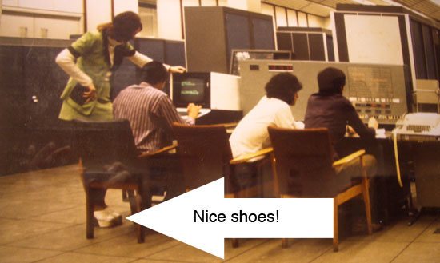
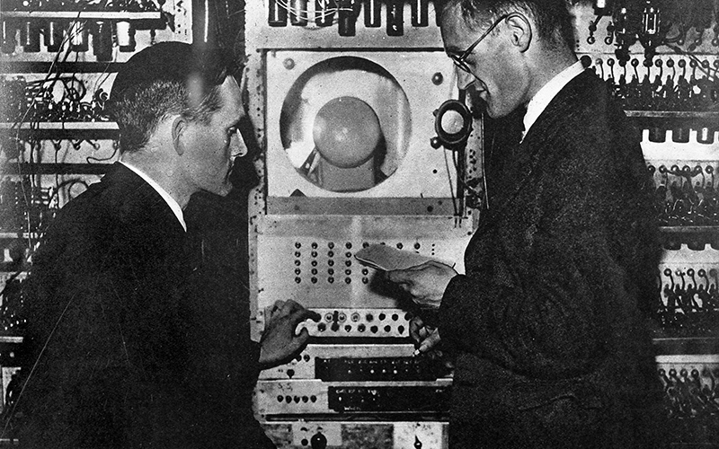

# Masters of Science 1948-2048 {#mastersofscience}

A journey through the time, stopping at the Computer Science classes of 2003, 1970, 1948 and 2048 in Manchester, with pictures and commentary.

## The Class of 1948, 1970, 2003 and 2048 {#y2003}  

Computers have been with us for a while, but let's start in 2003: Figure \@ref(fig:msc-fig) shows students of the MSc Computer Science class of 2003. The people in the picture are smiling because they are being entertained by [Richard Giordano](https://www.southampton.ac.uk/healthsciences/about/staff/richard_giordano.page), who took this picture while teaching.

```{r msc-fig, echo = FALSE, fig.align = "center", out.width = "100%", fig.cap = "(ref:captionmsc)"}
knitr::include_graphics("images/msc-2003.jpeg")
```
(ref:captionmsc) The class of 2003. Most of these people have moved on, although some stayed on to do research including [Matthew Horridge](https://web.stanford.edu/~horridge/), Michael Parkin, Karim Nashar and myself (the one in the back row with the dodgy haircut)

Thirty years earlier, before most of the people in the above picture were born, there was the...

## Class of 1970-something {#y1970}

Figure \@ref(fig:mu5-fig) shows Manchester staff and students circa 1970. Most socially well-adjusted people will have little interest in the [MU5 computer](https://en.wikipedia.org/wiki/Manchester_computers#MU5) that the people in the picture are using. However, a wider audience may be interested in the fantastic Saturday-Night-Fever style boots that the woman on the left of the picture (arrowed) is wearing.

```{r mu5-fig, echo = FALSE, fig.align = "center", out.width = "66%", fig.cap = "(ref:captionmu5)"}

```
(ref:captionmu5) “You know Fred once we've debugged this code, we're straight down the discotheque to dance the night away with the [Bee Gees](https://en.wikipedia.org/wiki/Bee_Gees). Gimme that night fever, [night fever](https://en.wikipedia.org/wiki/Night_Fever), we know how to show it.”

Now, Sun supremo [James Gosling](https://en.wikipedia.org/wiki/James_Gosling) has [fond memories of using a whopping 8K of memory](http://web.archive.org/web/20041010131526/http://today.java.net/jag/page6.html#51) from around about the same period. But if [Tom](https://en.wikipedia.org/wiki/Tom_Kilburn) and [Freddie](https://en.wikipedia.org/wiki/Frederic_Calland_Williams) (see section \@ref(y1948)) were alive today and had seen the [Four Yorkshiremen sketch](https://en.wikipedia.org/wiki/Four_Yorkshiremen_sketch) they'd probably say

> Memory? Memory! LUXURY....'Ere in Manchester, when we were lads and built computers, we didn't even
> have any memory. We had to make our own from an [old bit o' tube](https://en.wikipedia.org/wiki/Williams_tube) we found lying around in t'lab.
> 'Course it [only stored 2048 bits](http://curation.cs.manchester.ac.uk/computer50/www.computer50.org/mark1/ip-mm1.crt2048.html) and worked for a few hours. Ohhhh we used to DREAM of havin' 8K of
> memory....

They may have had to use very primitive memory, but at least Tom and Freddie didn't have to build their computers out of [mechanical discs and wheels](https://www.sciencemuseum.org.uk/objects-and-stories/lovelace-turing-and-invention-computers), or even better [Meccano](https://en.wikipedia.org/wiki/Differential_analyser#Use_of_Meccano)! Moving on swiftly, we go back a little further in time, twenty years earlier...

## Class of 1948 {#y1948}
Figure \@ref(fig:tomfred-fig) shows Tom and Freddie in 1948 with the [Manchester Baby](https://en.wikipedia.org/wiki/Manchester_Baby).

```{r tomfred-fig, echo = FALSE, fig.align = "center", out.width = "50%", fig.cap = "(ref:captiontomfred)"}

```
(ref:captiontomfred) [Freddie Williams](https://en.wikipedia.org/wiki/Frederic_Calland_Williams) and his PhD student [Tom Kilburn](https://en.wikipedia.org/wiki/Tom_Kilburn) programming the Manchester baby circa 1948.

Armed with some sticky-tape, several empty fairy-liquid bottles, lots of patience and the help of [some bloke called Alan Turing](https://en.wikipedia.org/wiki/Alan_Turing), Tom and Freddie built the world's first stored program computer. Was this the [world's first computer](http://www.bbc.co.uk/manchester/content/articles/2005/11/07/baby_computer_40_interview_feature.shtml)? Well, it depends on your definition: It is surprisingly [hard to define what counts as a computer and who built the first one](https://web.archive.org/web/20040606201305/http://www.dai.ed.ac.uk/homes/cam/fcomp.shtml). After Tom and Freddie, things were never the same again. The rest, as they say, is history. That computer you are using: desktop, tablet, phone, SatNav, washing machine, toaster etc is a direct descendant of the rather strange looking machine in figure \@ref(fig:tomfred-fig).

## Numbers speak louder than words {#louder}

What's interesting about the difference between 1948 and now are the changes in the efficiency, size and speed of computers, shown in table below. It's hard to describe in words the difference between 1948 and now, in this case, the numbers in table \@ref(tab:cputable) speak much louder than words ever could:

:  (\#tab:cputable) Advances in processor power 1948 to 2000

+--------------------------+------------------------------+-----------------------------+
| Feature                  | Manchester Baby (1948)       | Processor* from year 2000    |
+==========================+==============================+=============================+
| Size                     |  Filled a medium sized room  | fills 7mm by 3mm of silicon |
+--------------------------+------------------------------+-----------------------------+
| Power usage (Watts)      | 3.5kW (3500W)                | 215mW (0.215W)              |
+--------------------------+------------------------------+-----------------------------+
| Instructions executed    | 700                          | 100,000,000                 |
| (per second)             |                              |                             |
+--------------------------+------------------------------+-----------------------------+
| Energy efficiency        | 5                            | 0.000 000 002               |
| (Joules per instruction) |                              | e.g. 2,000,000,000 times more efficient than The Baby|
+--------------------------+------------------------------+-----------------------------+

The *processor from year 2000* referred to in table \@ref(tab:cputable) is the [ARM AMULET3H microprocessor](http://apt.cs.manchester.ac.uk/ftp/pub/apt/misc/Amu3Hv10.fm5.pdf) and are the only thing I can remember from [CS501: Machine architecture](https://web.archive.org/web/20210630214331/https://studentnet.cs.manchester.ac.uk/pgt/2004/CSSyllabus.pdf). The rest was blood, sweat and tears.

So where is all this going? What about the future? Let's take a [longer view](https://en.wikipedia.org/wiki/Long_Now_Foundation), and skip forward from 1948 to 2048...

## Class of 2048? {#y2048}
What will classes in the year 2048 be studying? Well in year 2048, Computer Science won't exist anymore either because:

* As [Richard Feynman](https://en.wikipedia.org/wiki/Richard_Feynman) said [Computer Science isn't actually a Science](https://web.archive.org/web/20071112020412/http://www.cs.man.ac.uk/~hulld/q2007-07-09.html) or
* As [Hal Abelson](https://en.wikipedia.org/wiki/Hal_Abelson) says, “[Computer Science isn't about Computers](http://groups.csail.mit.edu/mac/classes/6.001/abelson-sussman-lectures/)” or
* As [Paul Graham](https://en.wikipedia.org/wiki/Paul_Graham_(programmer)) says, [There is no such thing as “Computer Science”](http://www.paulgraham.com/hp.html) or
* As [George Johnson](https://en.wikipedia.org/wiki/George_Johnson_%28writer%29) says, [All Science Is Computer Science](https://www.nytimes.com/2001/03/25/weekinreview/the-world-in-silica-fertilization-all-science-is-computer-science.html), a sentiment echoed by [Bill Gates](https://en.wikipedia.org/wiki/Bill_Gates) who also thinks [Computation is Transforming the Sciences](https://web.archive.org/web/20080221053710/https://www.microsoft.com/presspass/exec/billg/speeches/2005/11-15SuperComputing05.aspx)

Either way, what is known as [Computer Science](https://en.wikipedia.org/wiki/Computer_science) today will have become so fundamental to many other areas of research, the discipline will naturally become more closely integrated with them. Take Manchester as an example, the hard-sums people will join the shiny new mathematics department, the architecture geeks and hardware nerds will join the engineering department, the Computational Biologists will go and join Life Sciences or Medicine, and so on. Of course, I could be very wrong here! As [Niels Bohr](https://en.wikipedia.org/wiki/Niels_Bohr) said:

> “Predictions are hard to make, especially about the future.”

Which is a good point to close this essay on.^[Originally written in about 2004, updated from [https://web.archive.org/web/20180729110412/http://www.cs.man.ac.uk/~hulld/msc2003.html](https://web.archive.org/web/20180729110412/http://www.cs.man.ac.uk/~hulld/msc2003.html)]
