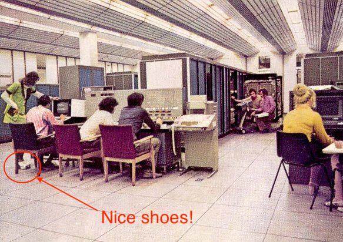
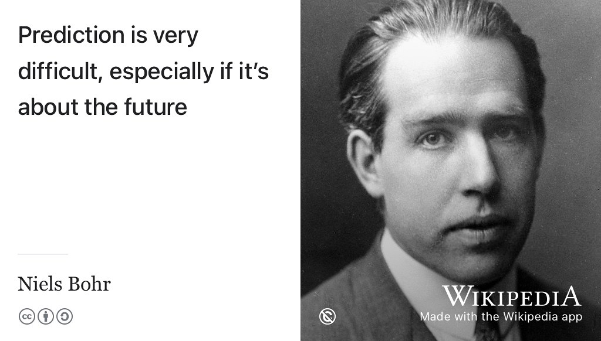

# (APPENDIX) Appendix {-}

# Computing from 1948 to 2048 {#mastersofscience}

One hundred years of computing from 1948 to 2048, stopping at the classes of 2003 and 1978, with pictures, dad jokes and some geeky history. [@lavington]

## The class of 2003 {#y2003}  

Let's start our computational odyssey in 2003, figure \@ref(fig:msc-fig) shows students of the MSc Computer Science class of 2003. That's me in the back row standing highest on the left hand side. We are smiling because we were being entertained and educated by [Richard Giordano](https://www.southampton.ac.uk/healthsciences/about/staff/richard_giordano.page), who took this picture while teaching. We are part of a student cohort of more than 10,000 students have graduated with some kind of degree in Computing (BSc, MSc or PhD) since the University [was the first in the UK to provide an undergraduate Computer Science degree course](http://www.bbc.co.uk/manchester/content/articles/2005/11/07/baby_computer_40_interview_feature.shtml) in 1965. [@babygrowsup]

```{r msc-fig, echo = FALSE, fig.align = "center", out.width = "100%", fig.cap = "(ref:captionmsc)"}
knitr::include_graphics("images/msc-2003.jpeg")
```
(ref:captionmsc) The class of 2003 including [Matthew Horridge](https://web.stanford.edu/~horridge/), Michael Parkin, Karim Nashar and myself in the back row

Twenty five years earlier, before many of the people in the above picture were born, there was the class of 1978...

## The class of 1978 {#y1978}

Figure \@ref(fig:mu5-fig) shows Manchester staff, and possibly some students, sometime between about 1972 and 1978. Most socially well-adjusted people will have little interest in the [MU5 computer](https://en.wikipedia.org/wiki/Manchester_computers#MU5) that the people in the picture are using. However, a wider audience may be interested in the suave and sophisticated seventies *[Saturday Night Fever](https://en.wikipedia.org/wiki/Saturday_Night_Fever)* dancing shoes that the woman on the left of the picture is wearing. [@nightfever]

```{r mu5-fig, echo = FALSE, fig.align = "center", out.width = "99%", fig.cap = "(ref:captionmu5)"}

```
(ref:captionmu5) “You know Jim once we've debugged this code, we're going straight down the discotheque to dance the night away to that groovy new hit record by those [local Manchester lads the Bee Gees](https://en.wikipedia.org/wiki/Bee_Gees). How does it go? *Night fever, [night fever](https://en.wikipedia.org/wiki/Night_Fever), we know how to show it*.” See the original unadulterated image via [Simon Lavington](http://www.computinghistory.org.uk/det/3638/Simon-Lavington/) and the Computer Conservation Society. [@mu5]

Now, Java junkie [James Gosling](https://en.wikipedia.org/wiki/James_Gosling) has [fond memories of using a whopping 8K of memory](http://web.archive.org/web/20041010131526/http://today.java.net/jag/page6.html#51) from around about the same period. [@gosling] But the class of 1948 (see section \@ref(y1948)) were alive today and had seen the [Four Yorkshiremen sketch](https://en.wikipedia.org/wiki/Four_Yorkshiremen_sketch) they'd probably say:

> Memory? Memory! LUXURY....'Ere in Manchester, when we were lads and built computers, we didn't even
> have any memory. We had to make our own from an [old bit o' tube](https://en.wikipedia.org/wiki/Williams_tube) we found lying around in t'lab.
> 'Course it [only stored 2048 bits](http://curation.cs.manchester.ac.uk/computer50/www.computer50.org/mark1/ip-mm1.crt2048.html) and worked for a few hours. Ohhhh we used to DREAM of havin' 8K of
> memory....

They may have had to use very primitive memory, but at least Tom and Freddie didn't have to build their computers out of [mechanical discs and wheels](https://www.sciencemuseum.org.uk/objects-and-stories/lovelace-turing-and-invention-computers), or even better [Meccano](https://en.wikipedia.org/wiki/Differential_analyser#Use_of_Meccano)! Moving on swiftly, we go back a little further in time, thirty years earlier...

## The class of 1948 {#y1948}
Our next stop is in 1948. We have to stop here because the [Manchester Baby](https://en.wikipedia.org/wiki/Manchester_Baby) first ran on 21st June 1948. Figure \@ref(fig:tomfred-fig) shows Tom and Freddie in with Baby. [@lavington]

```{r tomfred-fig, echo = FALSE, fig.align = "center", out.width = "99%", fig.cap = "(ref:captiontomfred)"}
knitr::include_graphics("images/kilburn_williams_manchester_baby.jpeg")
```
(ref:captiontomfred) [Freddie Williams](https://en.wikipedia.org/wiki/Frederic_Calland_Williams) and his PhD student [Tom Kilburn](https://en.wikipedia.org/wiki/Tom_Kilburn) programming the [Manchester baby](https://en.wikipedia.org/wiki/Manchester_Baby) in 1948.

Armed with some double-sided sticky-tape, several empty [fairy-liquid bottles](https://en.wikipedia.org/wiki/Fairy_(brand)), lots of patience and an idea from [some bloke called Alan Turing](https://en.wikipedia.org/wiki/Alan_Turing), Tom and Freddie built the world's first [stored-program computer](https://en.wikipedia.org/wiki/Stored-program_computer). The stored-program was significant as it was the predecessor to what we know call [random-access memory](https://en.wikipedia.org/wiki/Random-access_memory) (RAM).

Does this mean the Manchester Baby is the [world's first computer](https://www.computerhope.com/issues/ch000984.htm)? Well, it depends on your definition of computation: It is surprisingly hard to define what counts as a computer and who built the first one [@firstcomputer].

Whatever your definition, after Tom and Freddie, things were never the same again. The rest, as they say, is history. That computer you are using...

* laptop, desktop
* tablet, phone, satnav
* car, a computer with wheels
* plane, a computer with wings
* games console, wearable tech
* [smart card](https://en.wikipedia.org/wiki/Smart_card), embedded system etc
* household appliances, washing machine, doorbell etc


... is a direct descendant of the rather strange looking machine in figure \@ref(fig:tomfred-fig).

### Numbers speak louder than words {#louder}

What's interesting about the difference between 1948 and now are the changes in the efficiency, size and speed of computers, shown in table  \@ref(tab:cputable). It's hard to describe in words the difference between 1948 and now, in this case, the numbers speak much louder than words ever could:

:  (\#tab:cputable) Advances in processor power 1948 to 2000, the *Baby in 1948* is the Manchester Baby. The *ARM in 2000* refers the [ARM AMULET3H microprocessor](http://apt.cs.manchester.ac.uk/ftp/pub/apt/misc/Amu3Hv10.fm5.pdf) taken from [CS501: Machine architecture](https://web.archive.org/web/20210630214331/https://studentnet.cs.manchester.ac.uk/pgt/2004/CSSyllabus.pdf). Thanks to Jim Garside, Doug Edwards and [Steve Furber](https://en.wikipedia.org/wiki/Steve_Furber) for the data. [@amulet; @furberarm]

+--------------------------+------------------------------+-----------------------------+
|                          | Baby in 1948                 | ARM in 2000                 |
+==========================+==============================+=============================+
| Size                     |  Filled a medium sized room  | fills 7mm by 3mm of silicon |
+--------------------------+------------------------------+-----------------------------+
| Power usage (Watts)      | 3.5kW (3500W)                | 215mW (0.215W)              |
+--------------------------+------------------------------+-----------------------------+
| Instructions executed    | 700                          | 100,000,000                 |
| (per second)             |                              |                             |
+--------------------------+------------------------------+-----------------------------+
| Energy efficiency        | 5                            | 0.000 000 002               |
| (Joules per instruction) |                              | (that's 2,000,000,000 times more efficient than The Baby!)|
+--------------------------+------------------------------+-----------------------------+


So where is all this going? What about the future? Let's take a [longer view](https://en.wikipedia.org/wiki/Long_Now_Foundation), and skip forward from 1948 to 2048...

## The class of 2048? {#y2048}
Our next stop is 2048. For the number nerds out there, this year is pleasingly 100 years after 1948 so a sensible place to make our next stop. 2048 is also `100000000000` in binary (2^11^) and the maximum number of **bits** (not `bytes`) that the Manchester Baby stored in its Cathode Ray Tube (CRT) memory. A whopping 2048 bits, or 256 bytes, with 8 bit bytes! [@kilburnphd]

What will classes in the year 2048 be studying? Well, in the year 2048, Computer Science won't exist anymore either because:

* As [Richard Feynman](https://en.wikipedia.org/wiki/Richard_Feynman) said [Computer Science is not actually a Science](https://www.flickr.com/photos/dullhunk/51956613478/) [@feynmanfysics]
* As [Hal Abelson](https://en.wikipedia.org/wiki/Hal_Abelson) said the significance of computer science “[has little to do with computers](https://mitpress.mit.edu/sites/default/files/sicp/full-text/book/book-Z-H-7.html)” [@abelson]
* As [Paul Graham](https://en.wikipedia.org/wiki/Paul_Graham_(programmer)) said [There is no such thing as “Computer Science”](http://www.paulgraham.com/hp.html) [@bloggersandpainters; @hackersandpainters]
* As [George Johnson](https://en.wikipedia.org/wiki/George_Johnson_%28writer%29) said [All Science Is Computer Science](https://www.nytimes.com/2001/03/25/weekinreview/the-world-in-silica-fertilization-all-science-is-computer-science.html) [@georgejohnson]
* As [Bill Gates](https://en.wikipedia.org/wiki/Bill_Gates) said [Computation is Transforming the Sciences](https://web.archive.org/web/20080221053710/https://www.microsoft.com/presspass/exec/billg/speeches/2005/11-15SuperComputing05.aspx) [@gatescompute]

Either way, what is known as [Computer Science](https://en.wikipedia.org/wiki/Computer_science) today will have become so fundamental to many other areas of research, the discipline will naturally become more closely integrated with them. Take Manchester as an example, the hard-sums people will join the mathematics department, the architecture geeks and hardware nerds will join the engineering department, the Computational Biologists will go and join Life Sciences or Medicine, and so on. Of course, I could be very wrong here! As [Niels Bohr](https://en.wikipedia.org/wiki/Niels_Bohr) in figure \@ref(fig:bohr-fig) might have once said:

```{r bohr-fig, echo = FALSE, fig.align = "center", out.width = "99%", fig.cap = "(ref:captionbohr)"}

```
(ref:captionbohr) “Prediction is very difficult, especially if it's about the future”. Often attributed to Physicist [Niels Bohr](https://en.wikipedia.org/wiki/Niels_Bohr), it is disputed if he *actually* said this, see [wikiquote.org/wiki/Niels_Bohr#Disputed](https://en.wikiquote.org/wiki/Niels_Bohr#Disputed). Public domain image of Niels Bohr by the Nobel foundation on Wikimedia Commons [w.wiki/3dqV](https://w.wiki/3dqV)

Prediction is very difficult, especially if it's about the future. Which is a good point to close this essay on.^[Originally written in 2004, for some reason all my quotes were from men. Updated and refreshed in 2021 from the original at [https://web.archive.org/web/20180729110412/http://www.cs.man.ac.uk/~hulld/msc2003.html](https://web.archive.org/web/20180729110412/http://www.cs.man.ac.uk/~hulld/msc2003.html)]
