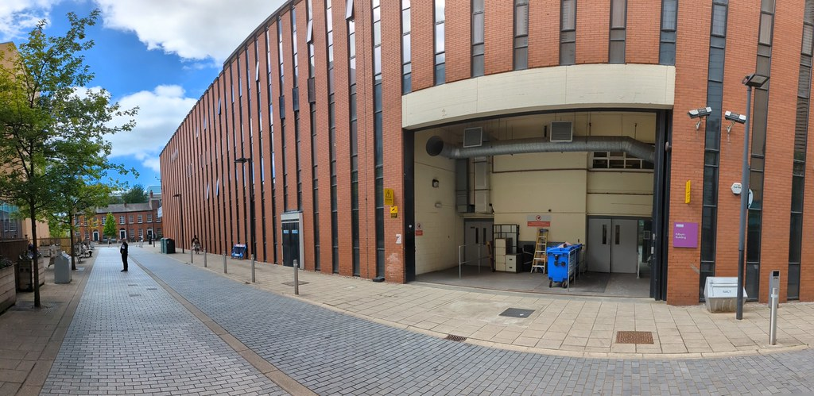
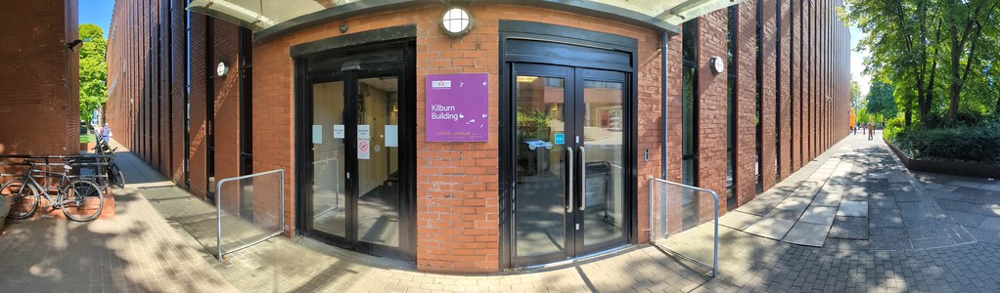

# Contacting the Future {#contact}

> The future has arrived — It’s Just Not Evenly Distributed Yet. [@gibson]

Unfortunately you can't contact the future, yet. While we wait for the future to become more evenly distrubuted you *can* contact me using the information below which includes directions to the Kilburn Buidling and parking information.

(ref:captioncycloturing) Paying homage to [Alan Turing](https://en.wikipedia.org/wiki/Alan_Turing) at a mural on the [Princess Parkway](https://en.wikipedia.org/wiki/A5103_road) by [tankpetrol.com](http://tankpetrol.com/). According to [Jonathan Swinton](https://www.manturing.net/jonathan), Turing is the “patron saint of Manchester” [@manturing]. As a [Manchester icon](https://en.wikipedia.org/wiki/Symbols_of_Manchester), he is commemorated locally by the [Alan Turing building](https://en.wikipedia.org/wiki/Alan_Turing_Building), the [Alan Turing Memorial](https://en.wikipedia.org/wiki/Alan_Turing_Memorial), [some blue plaques](https://duncan.hull.name/2021/07/07/turings-house/) and the [Alan Turing Way](https://www.google.com/maps/place/Alan+Turing+Way,+Manchester/) [@turingway]

```{r echo = FALSE, fig.align = "center", fig.cap = "(ref:captioncycloturing)", out.width = "100%"}
knitr::include_graphics("images/turingicon.jpg")
```

## Please Try Reading The Friendly Manual First {#rtfm}

If you're a student, please make sure you've [Read The Friendly Manual](https://en.wikipedia.org/wiki/RTFM) (RTFM), before asking me or my colleagues. There's a good chance your question will already be answered there, in particular:

* The Undergraduate (UG) Handbook <!--[wiki.cs.manchester.ac.uk/index.php/UGHandbook23:Main](https://wiki.cs.manchester.ac.uk/index.php/UGHandbook23:Main)-->
* The Placement handbook
* The student support website at [www.studentsupport.manchester.ac.uk](https://www.studentsupport.manchester.ac.uk/)

## Student Support {#sso}

If you can't find an answer to your question in section \@ref(rtfm), then get in touch. Bear in mind, I might not be the best person to talk to, depending on what you want. If you're a student, you might be better off contacting student support in person by the neon signs in the [Nancy Rothwell Building](https://en.wikipedia.org/wiki/Nancy_Rothwell_Building), see figure \@ref(fig:sso-fig).


```{r sso-fig, echo = FALSE, fig.align = "center", fig.cap = "(ref:captionstudentsupport)", out.width = "100%"}

```
(ref:captionstudentsupport) The Student Support Office (SSO) on the first floor of the [Nancy Rothwell Building](https://en.wikipedia.org/wiki/Nancy_Rothwell_Building) are here to help you, they should be your first port of call. If you have something more specific about a personal, academic or employment issue I may be able to help you.

You can contact student support using the emails below:

|  Query |  contact  | 
|---|---|
| General UG & PGT Queries  | soe.programmes@manchester.ac.uk  |   
|  Appeals and Conduct | soe.appealsandconduct@manchester.ac.uk  |   
| Assessment and Progression  | soe.assessment@manchester.ac.uk  |   
| Attendance Queries and Issues	 | soe.attendance@manchester.ac.uk |
| Programme Changes | soe.programmes@manchester.ac.uk |
| Course Unit Changes	 | soe.courseunits@manchester.ac.uk |
| Mitigating Circumstances, support and Welfare | soe.wellbeing@manchester.ac.uk |
| Placements | soe.placements@manchester.ac.uk |
| Timetabling |soe.timetabling@manchester.ac.uk  |
| Student Data | soe.studentdata@manchester.ac.uk |
| Student Support Hub | soe.hub@manchester.ac.uk |
| Student Experience^[for FSE careers bulletin] | soe.studentexperience@manchester.ac.uk |
| Visas | visas@manchester.ac.uk |
| Any Other Business (AOB) | soe.programmes@manchester.ac.uk |

If you  provide the following information in your email, they will be able to respond to your query more efficiently:

* `Name of Department` e.g. Computer Science
* `Student ID Number` 
* `Programme of Study` e.g. BSc Computer Science
* Brief description of how we can assist you

## Office in the Kilburn Building {#office}

My office is on the Lower First floor, Room LF25 of the [Kilburn building](https://en.wikipedia.org/wiki/Kilburn_Building) shown in figure \@ref(fig:kilburn-fig). From the Byte cafe on the lower first floor, go through the double doors on the South side of the building and down the ramp. LF25 is at the bottom of the ramp on the right, see [bit.ly/Kilburn-lower-first-floor](https://bit.ly/Kilburn-lower-first-floor). 

* 🏢 Room LF25, Kilburn Building
* ☎️ telephone:	+44 161 275 6186

Details of my office hours can be found in the Wednesday Waggle. 🐝

```{r kilburn-fig, echo = FALSE, fig.align = "center", fig.cap = "(ref:captionkilburnarama)", out.width = "100%"}
knitr::include_graphics("images/kilburnarama.jpg")
```
(ref:captionkilburnarama) A panoramic picture of the [Kilburn building](https://en.wikipedia.org/wiki/Kilburn_Building) taken from the [Oxford Road](https://en.wikipedia.org/wiki/Wilmslow_Road). The building stands next to [University Place](https://www.conference.manchester.ac.uk/venues/search/details/?property=10), shown in the right of the picture here, which looks a bit like a giant tin of baked beans.

## Postal Address {#postal}

Send post by carrier pigeon or snail mail to: 🐌

Dr. Duncan Hull  
Senior Lecturer  
Department of Computer Science  
Kilburn Building  
The University of Manchester  
Oxford Road  
Manchester  
M13 9PL  
[Lancashire](https://duncan.hull.name/2019/07/05/mancashire/) 🌹   

```{r kilburnsouth-fig, echo = FALSE, fig.align = "center", fig.cap = "(ref:captionkilburnsouth)", out.width = "100%"}

```
(ref:captionkilburnsouth) A panoramic picture of the South entrance of the [Kilburn building](https://en.wikipedia.org/wiki/Kilburn_Building) with the [Oxford Road](https://en.wikipedia.org/wiki/Wilmslow_Road) on the left hand side of the picture. 


## Kilburn Building Directions {#kilburn}

The [Kilburn building](https://en.wikipedia.org/wiki/Kilburn_Building) shown in figure \@ref(fig:kilburn-fig) is about 20 minutes walk from either [Manchester Piccadilly](https://www.nationalrail.co.uk/stations_destinations/man.aspx) (MAN) or ten minutes from [Manchester Oxford Road](https://www.nationalrail.co.uk/stations/mco/details.aspx) (MCO). Our official postcode (M13 9PL) takes you to [University Place](http://www.conference.manchester.ac.uk/venues/search/details/?property=10) (which looks like a giant tin of baked beans) next door, so you're better of using the [what3words locations](https://www.bbc.co.uk/news/uk-england-49319760) [@what3words] below which are more accurate:

* Google map of the Kilburn building [bit.ly/directions-to-kilburn-building](http://bit.ly/directions-to-kilburn-building)
* There are two ground floor entrances to the Kilburn building, North and South
  + North entrance: [what3words.com/port.museum.rips](https://what3words.com/port.museum.rips), see figure \@ref(fig:kilburnnorth-fig)
  + South entrance: [what3words.com/common.wiping.email](https://what3words.com/common.wiping.email), see figure \@ref(fig:kilburnsouth-fig)
* There is no formal reception so the best place to meet is [bit.ly/ByteCafe](http://bit.ly/ByteCafe) on the first floor
* See also [cs.manchester.ac.uk/about/maps-and-travel](https://www.cs.manchester.ac.uk/about/maps-and-travel/)

```{r kilburnnorth-fig, echo = FALSE, fig.align = "center", fig.cap = "(ref:captionkilburnnorth)", out.width = "100%"}

```
(ref:captionkilburnnorth) A panoramic picture of the North entrance of the [Kilburn building](https://en.wikipedia.org/wiki/Kilburn_Building) with the [Oxford Road](https://en.wikipedia.org/wiki/Wilmslow_Road) on the right hand side of the picture. 


## Parking at the Kilburn Building {#parking}

If you are driving, the nearest car parks are:

* **University Car Park B** [Manchester Aquatics Centre Car Park](https://www.apcoa.co.uk/parking-in/manchester/aquatics-centre/), Apcoa [M13  9SS](http://maps.google.co.uk/maps?q=M13+9SS)
* **University Car Park D** Booth Street West Car Park, [M15 6AR](http://maps.google.co.uk/maps?q=M15+6AR), access via Higher Cambridge Street
* See [estates.manchester.ac.uk/services/operationalservices/carparking](https://www.estates.manchester.ac.uk/services/operationalservices/carparking/)


## Duncan's Digital Doppelgängers  {#tinternet}

You can connect online with my [digital doppelgängers](https://en.wikipedia.org/wiki/Doppelganger:_A_Trip_Into_the_Mirror_World) on t'internet at:

* Blog: [duncan.hull.name](https://duncan.hull.name)
* Email:	`firstname.surname@manchester.ac.uk` 
* Github: [github.com/dullhunk](https://github.com/dullhunk)
* LinkedIn: [linkedin.com/in/duncanhull](https://uk.linkedin.com/in/duncanhull)
* [Microsoft Teams](https://en.wikipedia.org/wiki/Microsoft_Teams): using email `firstname.surname@manchester.ac.uk`
* YouTube: [youtube.com/\@coding-your-future](https://www.youtube.com/\@coding-your-future)
* Zoom: [zoom.us/my/duncanhull](https://zoom.us/my/duncanhull)


Besides Zoom/Teams, I can also use most other video conferencing software including^[so much software to choose from!]: [Amazon Chime](https://aws.amazon.com/chime/), [Bluejeans](https://en.wikipedia.org/wiki/BlueJeans), [Cisco Webex](https://en.wikipedia.org/wiki/Cisco_Webex), [Discord](https://en.wikipedia.org/wiki/Discord_(software)), [Google Hangouts](https://en.wikipedia.org/wiki/Google_Hangouts), [Jitsi](https://en.wikipedia.org/wiki/Jitsi) and [Slack](https://en.wikipedia.org/wiki/Slack_(software)). [@doppelganger]


```{r echo = FALSE, fig.align = "center", fig.cap = "(ref:captiondooncan)", out.width = "100%"}
knitr::include_graphics("images/dooncan-hool.jpg")
```
(ref:captiondooncan) Posing in the [Googleplex](https://en.wikipedia.org/wiki/Googleplex) at 1600 Amphitheatre Parkway in [Mountain View, California](https://en.wikipedia.org/wiki/Mountain_View,_California). Thanks to [Andrew Lang](https://www.linkedin.com/in/andrewlang) for taking this picture during [Science Foo Camp](https://en.wikipedia.org/wiki/Science_Foo_Camp) back in the more optimistic days of “[Don't be evil](https://www.cdyf.me/choosing#fig:evil-fig)” [@dontbeevil;@scifoo2007;@scifoo2009], old skool Google logos [@googlelogo] and the unfortunate [enshittification](https://en.wikipedia.org/wiki/Enshittification) of the internet. [@internetcon]  