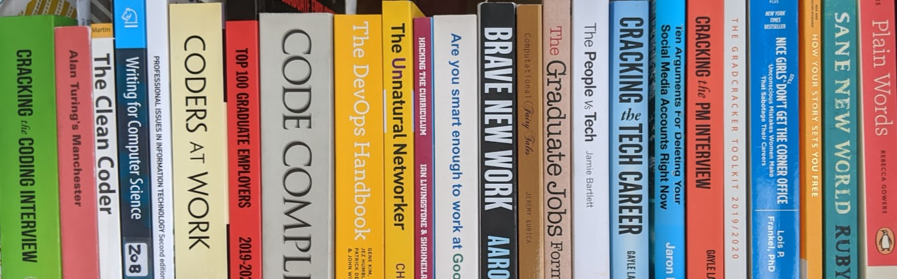

<!--`r if (knitr::is_html_output()) '-->
# Reading the Future {#references}

Here's a list of everything cited in these pages.

```{r shelfie-fig, echo = FALSE, fig.align = "center", out.width = "100%", fig.cap = "(ref:captionshelfie)"}

```
(ref:captionshelfie) How much of the future has already been written?

<!--'`-->
