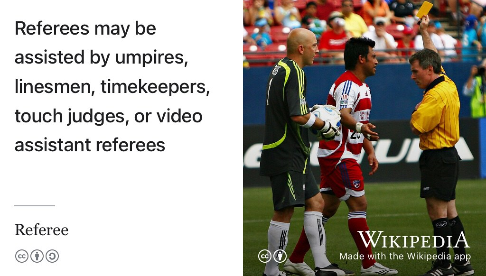

# Hello, World {-}

```{r unsplashed-fig, echo = FALSE, fig.align = "center", out.width = "66%", fig.cap = "(ref:helloworldy)"}
knitr::include_graphics("images/duncan_hull.png")
```

(ref:helloworldy) [Hello, World](https://en.wikipedia.org/wiki/Hello,_World): my name is Duncan and I'm a Senior Lecturer ([Associate Professor](https://en.wikipedia.org/wiki/Associate_professor)) in the Department of Computer Science at the University of Manchester. The left hand side of this picture is what I look like now, the right hand side was taken when I was a longer-haired undergraduate. 🎓

Hello and welcome to the [Department of Computer Science](https://www.cs.manchester.ac.uk/) at the [University of Manchester](https://www.manchester.ac.uk). My [name is Duncan](https://en.wikipedia.org/wiki/Duncan_(given_name)) and I'm a Senior Lecturer ([Associate Professor](https://en.wikipedia.org/wiki/Associate_professor)) with responsibility for managing our [Industrial Experience](https://www.cs.manchester.ac.uk/study/undergraduate/industrial-experience/) (IE) program. I [teach](https://personalpages.manchester.ac.uk/staff/duncan.hull/teaching) undergraduate & postgraduate students, supervise tutorials & projects while serving as [industrial experience & employability tutor](http://studentnet.cs.manchester.ac.uk/employment/placement/), [departmental forum](https://bit.ly/cs-departmental-forum) chair and a member of [University senate](https://www.manchester.ac.uk/discover/governance/structure/senate/). I'm interested [improving teaching, learning and the student experience](https://personalpages.manchester.ac.uk/staff/duncan.hull/research.html) by:

* Developing and delivering *Coding Your Future*: a course & guidebook for students at [cdyf.me](https://www.cdyf.me)
* Improving students communication skills by enabling them to start [writing their future](https://www.cdyf.me/writing), [debugging their future](https://www.cdyf.me/debugging) and [speaking their future](https://www.cdyf.me/speaking)
* Engaging with a wide range of employers through [our industry club](https://www.cs.manchester.ac.uk/connect/business-engagement/)
* Growing and building the teaching community by journal clubbing at [sigcse.cs.manchester.ac.uk](https://sigcse.cs.manchester.ac.uk/) and serving on the board of [uki-sigcse.acm.org](https://uki-sigcse.acm.org/)
* Supporting local schools both as a school governor and with the project [Coding Their Future](https://personalpages.manchester.ac.uk/staff/duncan.hull/coding-their-future.html)
* Teaching engineers to [make better software](https://software-eng.netlify.app/) in collaboration with our [industrial mentors](https://www.cs.manchester.ac.uk/connect/business-engagement/industrial-mentoring/)
* Updating students weekly on opportunities with the Wednesday Waggle newsletter at [waggle.cs.manchester.ac.uk](https://waggle.cs.manchester.ac.uk/waggle/about) 🐝

Our elective industrial experience program has [up to 100](#employability) students every year working in paid employment for the penultimate (“sandwich”) year-in-industry of their undergraduate degrees. If you are an [employer](https://personalpages.manchester.ac.uk/staff/duncan.hull/employers.html) who would like to recruit a summer intern, placement student or graduate please [get in touch](https://personalpages.manchester.ac.uk/staff/duncan.hull/contact.html).

## Full stack teaching  {-}
Regardless of the age or the stage, I enjoy the challenges of teaching and have taught english, maths, science and engineering to primary & secondary school children, undergraduates & postgraduates. In 2011, I completed a [Postgraduate Certificate in Education](https://en.wikipedia.org/wiki/Postgraduate_Certificate_in_Education) (PGCE) at the [University of Bath](https://www.bath.ac.uk/) and worked as a high school science teacher in co-educational [comprehensive (non-selective) state schools](https://www.gov.uk/types-of-school) in Swindon, Shaftesbury and Stockport before returning to higher education. I serve as a [school governor](https://www.manchester.ac.uk/connect/teachers/school-governors/) on the governing board of a school in Greater Manchester. As well as teaching in the UK I have also taught in India, Japan and America too. 🇪🇺🇬🇧🇮🇳🇯🇵🇺🇸

## What's the Story? {-}
What's the story, Jackanory? Born in [Bath, Somerset](https://en.wikipedia.org/wiki/Bath,_Somerset) and raised using a [secret West Country recipe](https://en.wikipedia.org/wiki/West_Country), [my story](https://uk.linkedin.com/in/duncanhull) is a mixture of Natural Science ([Plant Sciences, BSc](https://speakerdeck.com/dullhunk/why-study-plants)), Computer Science ([MSc](mastersofscience.html) & [PhD](https://www.librarysearch.manchester.ac.uk/permalink/44MAN_INST/1r887gn/alma992976677936301631)) and software engineering. Outside of academia, I’ve worked as a consultant and software developer for [BBC Monitoring](https://en.wikipedia.org/wiki/BBC_Monitoring), the [Ford Motor Company](https://en.wikipedia.org/wiki/Ford_Motor_Company) and the [National Health Service](https://en.wikipedia.org/wiki/National_Health_Service) (NHS). As an academic, I have been part of the [e-Science lab](https://esciencelab.org.uk/), [Apache Taverna](https://en.wikipedia.org/wiki/Apache_Taverna) and [myGrid](https://en.wikipedia.org/wiki/MyGrid) projects and completed a [postdoc](https://en.wikipedia.org/wiki/Postdoctoral_researcher) at the [Manchester Institute of Biotechnology](https://www.mib.manchester.ac.uk/) (MIB) on the [Pathtext project](https://pubmed.ncbi.nlm.nih.gov/20529930/). This was followed by a short stint as a software engineer of [Chemical Entities of Biological Interest](https://en.wikipedia.org/wiki/ChEBI) (ChEBI) at the [European Bioinformatics Institute](https://en.wikipedia.org/wiki/European_Bioinformatics_Institute) (EBI) in Cambridge, UK. 🧬👨‍🔬

## Toolbox {-}
This website was built using [bookdown](https://bookdown.org) with [R markdown](https://en.wikipedia.org/wiki/Markdown), the [R language](https://en.wikipedia.org/wiki/R_(programming_language)), [JavaScript](https://en.wikipedia.org/wiki/JavaScript), [knitr](https://en.wikipedia.org/wiki/Knitr), [LaTeX](https://latex4year1.netlify.app), [Pandoc](https://en.wikipedia.org/wiki/Pandoc), [GitHub](https://en.wikipedia.org/wiki/GitHub), [RStudio](https://en.wikipedia.org/wiki/RStudio) and TLC. The [source code is available](https://github.com/dullhunk/duncanome) and the documentation in *[Authoring Books and Technical Documents with R Markdown](https://bookdown.org/yihui/bookdown/)*. These pages are also available [in one single pdf file](https://personalpages.manchester.ac.uk/staff/duncan.hull/duncan-hull.pdf) and [and an ebook](https://personalpages.manchester.ac.uk/staff/duncan.hull/duncan-hull.epub). Thanks to [Yihui Xie](https://en.wikipedia.org/wiki/Yihui_Xie) and his collaborators for the handy tools and excellent documentation. 🙏

## Get a Life! {-}  
Outside of work I sing a [bassy](https://en.wikipedia.org/wiki/Bass_(voice_type))-[baritone](https://en.wikipedia.org/wiki/Baritone) in a local community [show choir](https://en.wikipedia.org/wiki/Show_choir), look after bees and enjoy learning greek language and culture, preferably in a [ταβέρνα](https://en.wikipedia.org/wiki/Taverna) or on a [Παραλία](https://en.wikipedia.org/wiki/Beach) in Greece. Άντε γειά! 🏖️🇬🇷 

<!--chapter:end:index.Rmd-->

# (PART) DUNCANOME {-}

# Studying Your Future {#teaching}

I teach, mentor, tutor, lecture on and supervise a variety of undergraduate and postgraduate courses. You can find me online during office hours, in the labs, my office hours, on [youtube.com/\@coding-your-future](https://www.youtube.com/\@coding-your-future) and in lecture theatres. 🎭

```{r echo = FALSE, fig.align = "center", out.width = "100%", fig.cap = "(ref:captionbbcsofa)"}
knitr::include_graphics("images/bbcbreakfastsofa.png")
```
(ref:captionbbcsofa) Posing on the [BBC Breakfast](https://en.wikipedia.org/wiki/BBC_Breakfast) red sofa with the winning team of the BBC / Barclays University Technology Challenge (UTC) in [MediaCityUK](https://en.wikipedia.org/wiki/MediaCityUK), Salford

## All Years: Debug Your Future {#allyears}

If you'd like to debug your CV, application form, covering letter and job search etc, read [debugging your future](https://www.cdyf.me/debugging) [@debugyourfuture] and [hacking your future](https://www.cdyf.me/hacking) [@hackingyourfuture], especially if you haven't written a CV, Résumé or LinkedIn profile before. Once you've done this you can send me any relevant documentation and then:

* Drop-in to my weekly one-to-one CV clinics for Computer Science students online during term-time during my open office hours
* Get feedback on your CV from as many other people as possible, because "[given enough eyeballs, all bugs are shallow](https://en.wikipedia.org/wiki/Linus%27s_law)" [@Raymond1999]

```{r bugfeature-fig, echo = FALSE, fig.align = "center", out.width = "100%", fig.cap = "(ref:captionbuggingcv)"}
knitr::include_graphics("images/Features not bugs.png")
```

(ref:captionbuggingcv) Is that a bug or a feature in your CV? It's important to [debug your CV](https://www.cdyf.me/debugging) before an employer sees it, see the Wednesday Waggle for details of my weekly live debugging sessions. Features not bugs picture by [Visual Thinkery](https://visualthinkery.com) is licensed under [CC-BY-ND](https://creativecommons.org/licenses/by-nd/4.0/)  

Outside of term time, it's best to book a debugging appointment. 🐛

## First Year Students {#year1}

If you're in your first year of study, I serve as:

* Academic staff member for [First year team projects: COMP101](https://studentnet.cs.manchester.ac.uk/ugt/COMP10120/syllabus/) led by [Ulrike Sattler](http://www.cs.man.ac.uk/~sattler/) [@COMP10120], see the [getting started with LaTeX lab manual](http://latex4year1.netlify.app)
* Mentor and tutor to one group of six first year students
* Organiser of first year guest lectures, which mostly run in the second semester, February to May

## Second Year Students {#year2}

If you're in your second year of study, I serve as:

* Course leader for [Coding your Future: COMP2CARS](https://www.cdyf.me/) a course designed by me for (primarily) second year students to design, build, test and debug their futures in computing.
* Organiser of the labs for the [software engineering mentoring program](https://www.cs.manchester.ac.uk/connect/business-engagement/industrial-mentoring/)
* Teaching team member for [second year software engineering: COMP23311](https://studentnet.cs.manchester.ac.uk/ugt/COMP23311/syllabus/), a course designed by [Suzanne Embury](http://www.cs.man.ac.uk/~embury/) [@COMP23311; @git]

Previously I served as [second year tutor](https://studentnet.cs.manchester.ac.uk/ugt/year2/) from 2016 through to 2020, and course leader for second year software engineering from 2020 to 2022.

## Penultimate Year Students {#penultimate}

If you're on placement during your penultimate year (your last-but-one), I serve as:

* Course leader for "with industrial experience" (IE), an elective and intercalated year in industry.
* Year tutor for students on placement, either face to face or via telecon

## Final Year Students {#finalyear}

If you're in your final year of study, you'll find me:

* Supervising final year educational projects based in secondary schools in Greater Manchester, see [coding their future](https://personalpages.manchester.ac.uk/staff/duncan.hull/coding-their-future). [@computinged] 👩‍💻👨‍💻

## Masters Students {#masters}

If you're doing a Masters degree, you'll find me:

* Leading the course on [Principles of Digital Biology](http://studentnet.cs.manchester.ac.uk/pgt/COMP60532/syllabus/) which covers [Bioinformatics](https://en.wikipedia.org/wiki/Bioinformatics), [Computational Biolgy](https://en.wikipedia.org/wiki/Computational_biology) and a bit of [medical informatics](https://en.wikipedia.org/wiki/Health_informatics) 🧬
* Supervising [Master of Science](https://www.cs.manchester.ac.uk/study/masters/) projects in Computer Science and Data Science. [@r4ds] This typically involves various combinations of Wikipedia, Wikdata, [SPARQL](https://en.wikipedia.org/wiki/SPARQL) [@ducharme] and chatbots. 🤖 [@myca]

## PhD Students {#phds}

If you've got any interesting PhD research ideas you like to pitch to me, particularly if they involve [computer science education](https://sigcse.cs.manchester.ac.uk) or professional issues, I'm all ears! 👂

## Extracurricular and Flexible Learning {#extra}

Outside all of the above, I'm a promoter and supporter of flexible and extracurricular learning including:

* Organising, facilitating and promoting extra-curricular activities such as [hackathons](https://en.wikipedia.org/wiki/Hackathon) [@Briscoe; @Warner2017] and [edit-a-thons](https://en.wikipedia.org/wiki/Edit-a-thon). [@goodbadugly; @troubled; @findingada2019] These usually occur off-timetable, for example Wednesday afternoons, evenings and weekends.
* Judging competitions such as [studenthack.com](https://www.studenthack.com) and [greatunihack.com](https://greatunihack.com) since 2014. These two hackathons are organised by [UniCS](https://www.unicsmcr.com/), a student-led tech society formed by the merger of HackSoc (computer geekery) and CSSoc (socialising). Many other hackathons exist, they are usually aimed at beginners looking to learn new skills, rather than experts looking to compete. [@Briscoe; @hafb]
* Piloting the introduction of Microsoft Fundamental Certifications across the University in collaboration with the [Flexible Learning Program](https://www.manchester.ac.uk/discover/teaching-and-learning-excellence/flexible-learning/) see [cdyf.me/achieving#microsoft](https://www.cdyf.me/achieving#microsoft). [@georgepettifer]


## Teaching Awards {#awards}

Thanks to all the students at the [University of Manchester Students' Union](https://en.wikipedia.org/wiki/University_of_Manchester_Students%27_Union) (UMSU) who nominated me for an academic advising champion award in 2024, see [manchesterstudentsunion.com/awards](https://manchesterstudentsunion.com/awards) and figure \@ref(fig:su-fig). These annual awards recognise the achievements of staff and students who have gone above and beyond to represent student interests. [@su2024]

```{r su-fig, echo = FALSE, fig.align = "center", out.width = "99%", fig.cap = "(ref:su2024)"}
knitr::include_url('https://www.youtube.com/embed/pe-M8_lKUz0')
```

(ref:su2024) Thanks to all the students at the UMSU who nominated me for academic advising award and thanks Sambbhav for recording it. UMSU is the largest students' union in the UK representing over 40,000 students. You can also watch the full 30 second video embedded in this figure at [youtu.be/pe-M8_lKUz0](https://youtu.be/pe-M8_lKUz0) [@youtube-su2024]

<!--chapter:end:01-teaching.Rmd-->

# Employing Your Future {#employers}
If you are an employer, graduates and undergraduates are an important part of the future of your organisation. Collaborating with us in the Department of Computer Science is one of the best ways to encourage students from the University of Manchester to join your organisation as employees both before and after they graduate, see figure \@ref(fig:graduating-your-fig).

```{r graduating-your-fig, echo = FALSE, fig.align = "center", out.width = "100%", fig.cap = "(ref:captiongradceremony)"}
knitr::include_graphics("images/employing-your-future.jpeg")
```

(ref:captiongradceremony) Are these graduates the future of your organisation? If you want them to be, you need to engage early and often with students *before* they graduate. This will increase your chances of recruiting them. University of Manchester graduates celebrating their graduation outside the [Samuel Alexander](https://en.wikipedia.org/wiki/Samuel_Alexander) building with photobombing by [Gavin Brown](https://profgavinbrown.github.io/) 🎓

If you're not recruiting graduates, your organisation may suffer in the longer term as talented and young employees decide to work for other employers. Recruiting graduates is a cost effective way to build the skills and knowledge your organisation needs to succeed in the future.

## Recruiting Computer Science Students {#recruiting}

We collaborate with a wide range of employers from the smallest bedroom startup to the worlds largest multi-national corporations, and are always looking for more organisations that can offer our students a stimulating working environment to start their careers. According to [highfliers.co.uk](https://www.highfliers.co.uk), the University of Manchester is the most targeted University in the UK by the [Times Top 100 Graduate Employers](https://www.top100graduateemployers.com). [ @Birchall2019] We can still do better, for example by engaging with a more diverse group of employers, especially those in Manchester and the [Northern Powerhouse](https://northernpowerhouse.gov.uk/), see [git.io/manc](https://git.io/manc). [@gitmanc; @londonvstherest; @hebdenbridge; @manhattanchester; @manchattan]

```{r echo = FALSE, fig.align = "center", out.width = "100%", fig.cap = "Any employer recruiting our students is welcome to join our industry club, see details below"}
knitr::include_graphics("images/industry-club-wide.png")
```

If you are recruiting computer scientists and software engineers as a summer interns, placement students or as graduates please get in touch with me or [Mabel Yau](https://uk.linkedin.com/in/mabel-yau) (careers and placements officer). We typically have around 250 undergraduate students graduating annually, alongside a smaller number of Masters and PhD students. The [entry tariff](https://www.ucas.com/ucas/tariff-calculator) of our undergraduate students (A* A* A* including mathematics) is comparable to other leading Computer Science (CS) departments in [Russell Group](https://en.wikipedia.org/wiki/Russell_Group) universities as shown in the table below.


Institute | UCAS entry tariff  
----------- | ----------- | --------
[University of Manchester](https://www.manchester.ac.uk/study/undergraduate/courses/2024/00560/bsc-computer-science/course-details/) | A* A* A*
[University of Cambridge](https://www.undergraduate.study.cam.ac.uk/courses/computer-science) | A* A* A
[University College London](https://www.ucl.ac.uk/prospective-students/undergraduate/degrees/computer-science-bsc)| A* A* A
[Imperial College London](https://www.imperial.ac.uk/computing/prospective-students/courses/ug/beng-meng-computing/) | A* A* A
[University of Oxford](https://www.ox.ac.uk/admissions/undergraduate/courses-listing/computer-science) | A* A A

<!--
| CS Students per year
| ~100
| ~150
| ~200
| ~250
| ~50-->


If you are looking to recruit science and engineering students from other disciplines like [Physics](https://www.physics.manchester.ac.uk/), [Maths](https://www.maths.manchester.ac.uk/), [Chemistry](https://www.chemistry.manchester.ac.uk/), Mechnical, Aerospace & Civil Engineering ([MACE](https://www.mace.manchester.ac.uk/)), [Materials Science](https://www.materials.manchester.ac.uk/) and Electrical & Electronic Engineering ([EEE](https://www.eee.manchester.ac.uk/)) you should talk to:  

* academic staff in those departments and/or  
* the central careers service of the University via [employers.manchester.ac.uk](http://www.employers.manchester.ac.uk/)

<!--UPDATE THIS: A demographic breakdown of our students in Computer Science is show in Figure fig:pie-fig-->

## Careers Fairs {#careersfairs}
Our annual Computer Science careers fair is held in the Kilburn building in autumn, we typically have around 30 employers exhibiting over two days. As space is limited, we are always over-subscribed and are not able to accommodate every employer that our students will be interested in. We give priority to employers that offer internships, placements and graduate roles and have contributed to our community through the activities described on this page. The central careers service also organises:  

* the big careers fair every autumn, see the [events](https://www.careers.manchester.ac.uk/events/)
* a smaller careers fair in May
* hundreds of other employer events on campus during term time [@highfliers2020]

## Drop-in Sessions {#dropins}
If you aren't willing or able to exhibit at careers fairs, we also run ad-hoc drop-in sessions where employers can come in and set up a stand in the foyer to talk to computer science students informally on their way to and from lectures. These usually happen during lunch in [term time](https://www.manchester.ac.uk/discover/key-dates/). If you're interested in exhibiting at either of these events, please [contact the careers and placements officer Mabel Yau](#office).

## Industry Club {#industryclub}

```{r echo = FALSE, fig.align = "center", out.width = "40%"}
knitr::include_graphics("images/industry-club-black.png")
```

All employers are welcome to join our industry club mailing list by sending an email to listserv@listserv.manchester.ac.uk with the the text **subscribe cs-industryclub yourfirstname yoursecondname** in the body of the email message. The industry club is part of our [wider business engagement activities](https://www.cs.manchester.ac.uk/connect/business-engagement/).

The mailing list is low-traffic, typically two to three updates per year and an invitation to our annual industry club meeting. We promise not to spam you or sell your email details on to third parties.

## Industrial Mentoring {#mentoring}
The [Industrial mentoring scheme for software engineers](https://www.cs.manchester.ac.uk/connect/business-engagement/industrial-mentoring/) allows employers meet students during code review sessions.

## Co-supervised Projects {#cosupervise}
If you would like to co-supervise a project student in collaboration with an academic member of staff, there are several options. The best option depends on the domain, level and duration of the project:

* **Bachelors projects**: these are completed in the final year of a Bachelors degree and last for six months, starting in September and finishing in March. Projects are proposed (and offered to students) in March and start in September of the same year.
* **Masters projects**: again these are six months in duration but start in March and finish in September. Projects are proposed (and offered to students) in the preceding November.
* **PhD projects**: For industrially sponsored or co-supervised projects, speak to the research office at [cs.manchester.ac.uk/research](https://www.cs.manchester.ac.uk/research/).
* **Knowledge Transfer Partnerships**: We have a range of [KTPs](https://www.gov.uk/guidance/knowledge-transfer-partnerships-what-they-are-and-how-to-apply), speak to the research office for details
* **Impact Acceleration Accounts**: We have a range of [IAAs](https://epsrc.ukri.org/innovation/fundingforimpact/impact-acceleration-accounts/), speak to the research office for details

For Bachelors and Masters projects, you can contact academic members of staff directly, or speak to [Terence Morley](https://research.manchester.ac.uk/en/persons/terence.morley) (final year project lead) or [Thomas Thomson](https://research.manchester.ac.uk/en/persons/thomas.thomson), who leads our postgraduate taught (Masters) courses.

<!-- give an example project template -->


## The Wednesday Waggle

During term time, we highlight events and vacancies for Computer Science students from a [wide range of sources](https://www.cdyf.me/finding) in a weekly newsletter called the *Wednesday Waggle* ([waggle.cs.manchester.ac.uk](https://waggle.cs.manchester.ac.uk/waggle/about)) 🐝. This goes out to around ~1500 Bachelors and Masters Computer Science students in Manchester each week. If you have vacancies or events you would like our students to know about, you can advertise them at [careerconnect.manchester.ac.uk](https://careerconnect.manchester.ac.uk/), and let me know when they are live in the system, then I can highlight them to the weekly newsletter. Alternatively, point us to where they are advertised online, see [advertising vacancies to students](https://www.cdyf.me/finding#studentjobs). It can help students find your needle in the jobs haystack.

## Join the Community

There is a thriving community of engineers and [entrepreneurs](https://www.accelerateme.co/) in Manchester and across the North of England. One of the best ways to recruit engineers and scientists is to join and _contribute_ to the community. Get involved in events, [sponsor a hackathon](https://www.unicsmcr.com/), deliver a guest lecture, host your own event or [become a software engineering mentor](https://www.cs.manchester.ac.uk/connect/business-engagement/industrial-mentoring/). Employers who engage **early and often** are much more likely to get something back. As an employer, you may also be interested in events run by:

* The [Institute of Student Employers](https://ise.org.uk/) (ISE)
* The [Association of Graduate Careers Advisory Services](https://www.agcas.org.uk) (AGCAS)
* The [Work Based and Placement Learning Association](https://www.asetonline.org) (ASET)

If you're a startup new to employment, you may find the guide at [gov.uk/employ-someone](https://www.gov.uk/employ-someone) useful.

## Buzzing!

At peak times, we can get **very busy** with many concurrent employer events on campus, see figure \@ref(fig:busy-fig). Please be patient and persistent if we do not reply immediately. Unfortunately, we are not always able to respond to everyone because our students, staff and space are all finite resources. We give priority to employers that have already given their time and expertise to our community.

(ref:captionhighfliers) According to [highfliers.co.uk](https://www.highfliers.co.uk), the University of Manchester is the second most targeted University in the UK by the [Times Top 100 Graduate Employers](https://www.top100graduateemployers.com) [@highfliers2024]

```{r busy-fig, echo = FALSE, fig.align = "center", out.width = "100%", fig.cap='(ref:captionhighfliers)'}
knitr::include_graphics("images/high-fliers-table-2024.png")
```

## Employability
We are working hard to improve the employability of students because while having a Computer Science is necessary for some jobs, it is not sufficient. [@unemployed; @shadboltreview; @fincherreview; @finchergecco] Over the last decade we have been successful in *more than doubling* the number of our students going on year long placements in industry to around 100 per year, see figure \@ref(fig:ie-fig). This is a win-win-win situation for:

1. **Students**: benefit from a broader education, and develop social and non-cognitive skills that can be challenging to teach and learn in a purely academic environment. This is known as the [winning personality](https://www.suttontrust.com/research-paper/a-winning-personality-confidence-aspirations-social-mobility/) [@winningpersonality].
2. **Employers**: placements are a cost-effective way for employers to recruit (and retain) graduate talent
3. **Universities**: produce better graduates [@Mandilaras2004] with broader and deeper skills, who earn more and get better jobs [@winningpersonality]. Well paid placements can also facilitate social mobility. [@Wang2018]


```{r ie-fig, echo = FALSE, results='hide', message=FALSE, warning=FALSE, fig.align = "center", out.width = "100%", fig.cap = "(ref:ieblurb)"}

library(tidyverse)
library(ggplot2)

evenmoarplacements <- readr::read_csv("https://raw.githubusercontent.com/dullhunk/cdyf/master/data/onie.csv")


ggplot(data = evenmoarplacements) + geom_bar(mapping = aes(x = year, y = students), stat = "identity")
```

(ref:ieblurb) Number of undergraduate Computer Science students completing a year in industry as part of their degree at the University of Manchester. Since 2008 over 900 students have completed the program. I have been leading the program since 2012 and managed to ~double the number of students doing placements per year. As you can see in the histogram, the COVID-19 pandemic started having an effect on students starting placements in 2020.


Previously our students have secured year long placements at a wide range of employers including Accenture, Agilent Technologies, Amazon, AND Digital, Apadmi, Arggo, ARM, Autodesk, AVL Powertrain, BAML, the BBC, Biorelate, BJSS, Bloomberg, BMW Mini, Bsquare Controls, BT, Cantarus, Celtra, CERN, Codethink, d3t, Elysian Systems, Feral Interactive, Fidelity, FiveAI, HMRC, IBM, Imagination Technologies, Intel, ISA Software, JP Morgan, Keysight Technologies, KPMG, Matillion, McAfee, Mentor Graphics, Monoprix, Morgan Stanley, NCC Group, Nokia, Nomura, Novacoast, Ocado, PA Consulting, PwC, Schlumberger, ServiceNow, Siemens, Soda Software, SteamaCo, The Hut Group, The Start Up Factory, Uber, Visa and Vodafone.

There's still more we can do to improve the employability of our graduates. If you'd like to help our graduates become more employable, [get in touch](contact).

<!--
## Guest lectures from employers {#guestlectures}

The Department of Computer Science welcomes external speakers and hosts a number of guest lectures from a wide range of collaborators in industry and academia. There are several ways the department can host guest lectures

* Scheduled lectures for [COMP101](https://studentnet.cs.manchester.ac.uk/ugt/COMP10120/syllabus/), a first year course with 400+ enrolled students. During 2021, these talks take place on Mondays from midday to 12.50pm on zoom
* School research seminars , see [examples of past seminars](https://www.cs.manchester.ac.uk/connect/events/past-events/)
* Technical talks arranged as part of a scheduled course, speak to the [course leader for the relevant course](https://www.cs.manchester.ac.uk/about/people/). These tend to be more advanced courses aimed at students later in their degrees or as part of postgraduate study.
* One-off talks arranged *ad hoc* that are not part of scheduled series of lectures
* Seminars and talks from speakers arranged and booked by students, for example [unicsmcr.com](https://unicsmcr.com/), The University of Manchester Computer Science society

### Examples of COMP101 lectures

Some example guest lectures for COMP101 are shown below to give a flavour of the kind of talks that are appropriate

* Hacking the Hacks, delivered by NCC Group
* Debunking the myths associated with User Experience, delivered by American Express
* The Business of Intellectual Property, delivered by Imagination Technology)
* How to Break a Hacker's Mind, Web Application Vulnerabilities Exposed, delivered by Morgan Stanley
* 100 billion ARM chips, delivered by ARM
* Software at Airbus
* Computing in the Community, delivered by CodeClub & Manchester Girl Geeks
* How to be a brilliant software engineer, delivered by Apadmi


### Interested in speaking?
For COMP101, we are always looking for good speakers who can engage large groups of students on interesting topics that they care about and relate to Computer Science. For COMP101, there are a limited number of guest lecture slots (around 20) which run through term-time starting in November and finishing in early June. Its important that speakers

* Give much more than a sales pitch for an organisation, by providing insight into a technical subject
* Talk about content that relates to the (very broad) syllabus of COMP101
* Engage, interact, educate and entertain. Students vote with their feet (by not turning up) if they think a lecture won't be interesting
* If you would like to propose a guest lecture for COMP101, please contact Duncan Hull. For all other external seminars and events, see the links above.

Since lockdown, lectures have been online, which has allowed for more interaction, typically via the chat dialogue. We can monitor and moderate the chat, feeding questions to the speaker when it's appropriate.-->

<!--chapter:end:02-employers.Rmd-->

# Coding Your Future

Your future is bright, your future needs coding. So let's starting coding your future.

*Coding Your Future* is a guidebook written to help students design, build, test and code their futures in computing, see figure \@ref(fig:cdyf-fig). Written by yours truly, [@cdyf] the full text of the book is freely available online at [www.cdyf.me](https://www.cdyf.me). If you'd prefer to read it in ebook format, you can also download it in a single file, see section \@ref(downloading).

```{r cdyf-fig, echo = FALSE, fig.align = "center", out.width = "98%", fig.cap = "(ref:captioncdyf)"}

```

(ref:captioncdyf) Coding your Future is a guidebook to help students design, build, test and code their futures in computing, see [www.cdyf.me](https://www.cdyf.me). *Coding your Future* illustration by [Visual Thinkery](https://visualthinkery.com/) is licensed under [CC-BY-ND](https://creativecommons.org/licenses/by-nd/4.0/)

## Reading Your Future {#reading}

Coding your future is a guidebook and course is aimed at ALL students in higher education. While the guide supports undergraduate teaching at the University of Manchester, it doesn’t actually matter:

* *where* in the world you are studying
* what *stage* of your degree you are at, from first year through to final year
* what *level* you are studying at, foundation, undergraduate or postgraduate
* what *institution* you are studying at, this book is University and institution agnostic
* what *subject* you are studying, as long as you are **computationally curious**

*Coding your Future* has something for any student of computing, both those inside and outside of Computer Science departments. 👨🏿‍💻👨‍💻👩🏽‍💻👩‍💻👩🏿‍💻

## Downloading Your Future {#downloading}

The full text of the guidebook is freely available at [www.cdyf.me](https://www.cdyf.me/), this means the web version (that's all the `*.html`) is searchable, browsable and linkable in any web browser on your phone, tablet or desktop computer. If you'd prefer to read the guidebook in a single ebook file, you can download a copy at:

* [cdyf.pdf](https://www.cdyf.me/cdyf.pdf)
* [cdyf.epub](https://www.cdyf.me/cdyf.epub)

Since the guidebook is published open access and open source, I welcome constructive feedback from students, employers, academics and any other contributors, see [cdyf.me/#contributing](https://www.cdyf.me/#contributing)

<!--chapter:end:03-coding-your-future.Rmd-->

# Coding Their Future {#coding-their-future}

Their future is bright, their future needs coding. So let's start coding their future... 

(ref:captioncodingtheirfuture) Is it art or is it science? It's both: Undergraduate students regularly practice the art of [computer science education](https://en.wikipedia.org/wiki/Computer_science_education) in secondary schools as part of our wider [social responsibility activities](https://www.cs.manchester.ac.uk/connect/social-responsibility/) [@m2020; @m20202] and [schools, colleges and public activities](https://www.cs.manchester.ac.uk/connect/schools-colleges-public/) Picture of children coding adapted from an original by Arno Mikkor on Wikimedia Commons [w.wiki/65A2](https://w.wiki/65A2) using the [Wikipedia app](https://apps.apple.com/us/app/wikipedia/id324715238)

```{r echo = FALSE, fig.align = "center", out.width = "98%", fig.cap = "(ref:captioncodingtheirfuture)"}
knitr::include_graphics("images/computer-science-education.jpeg")
```


Coding their future is a collaboration & partnership between secondary schools and the [Department of Computer Science](https://www.cs.manchester.ac.uk/) at the University of Manchester. Our aims are to:

* improve and support computing education before, during and after [GCSE Computer Science](https://www.bbc.co.uk/bitesize/subjects/z34k7ty), particularly at key stages 3, 4 and 5. [@shutdownrestart; @afterthereboot; @cse; @cambridgegcse]
* [widen participation in higher education](https://www.manchester.ac.uk/discover/social-responsibility/widening-participation/), especially in under-represented groups. [@assir; @classceiling; @nicebutdim; @breakintoelite]
* enable our undergraduate students to develop their leadership and communication skills by working with young people in the classroom

The University provides schools with a final year student who can teach Computer Science in your school or college as a teaching assistant (TA). In return, the school provides our undergraduate students with a safe and supportive environment in which to teach which extends and augments your current curriculum. This can either be an after school, extension / lunchtime club or during scheduled lesson time, typically between year 7 and 13. This is similar to the [Undergraduate Ambassador Scheme](https://en.wikipedia.org/wiki/Undergraduate_Ambassadors_Scheme) (UAS), [@uas; @Cooper2005] and school placements [@Moller2019] except students work is assessed using our final year project framework. [@COMP30030; @COMP30040] 


## Why Teach Coding? {#whycode}

Coding, programming, software engineering and computer science - whatever you want to call it, builds key foundational skills and knowledge that **all** students need to learn regardless of their aspirations. Children don't learn to code just to become coders, they learn to code so they can build problem solving skills and develop an understanding how the digital world they inhabit functions. [@peytoncode] Sam Aaron, creator of the [sonic-pi.net](https://sonic-pi.net/) makes this case in figure \@ref(fig:sonic-pi-fig).

```{r sonic-pi-fig, echo = FALSE, fig.align = "center", out.width = "99%", fig.cap = "(ref:sonicpi)"}
knitr::include_url('https://www.youtube.com/embed/0lTZ8Tuyu5I')
```

(ref:sonicpi) If you're making presentations for students to watch before or after your lessons, its worth spending some time thinking about how to make your slides video friendly. You can also watch the full 7 minute video embedded in this figure at [youtu.be/0lTZ8Tuyu5I](https://youtu.be/0lTZ8Tuyu5I) [@youtube-sonicpi]

Like Maths and English: Coding is for everybody, not just the techies. 

## Participating Schools {#schools}

Since these projects were started in 2012, our undergraduate students have worked in twenty different schools in Greater Manchester. Participating organisations are mostly non-selective state schools, to align with the [University of Manchester's values of social responsibility and civic engagement](https://www.manchester.ac.uk/discover/vision/). Current and previous participating schools are shown in table \@ref(tab:schooltable), ranked by the percentage of their students entitled to free school meals (FSM). 

:  (\#tab:schooltable) Schools our undergraduate students have worked with in teaching computing in since 2013, ordered by the percentage of students entitled to free school meals (FSM). As of 2023, the UK average for students entitled to FSM according to gov.uk is **23.8%**. [@averagefsm] This number has been increasing over the last decade as the UK falls behind on tackling child poverty [@childpoverty;@bbcfsm] Note that all private schools have an FSM percentage of zero because their students do not qualify for benefits, which makes it difficult to compare intakes of state and private schools. It seems likely that children in private schools probably don't need free school meals anyway. 

+--------------------------------------------------------------------------------------+--------------+---------------------------------------+
|   School                                                                             | Location     | % FSM via gov.uk                      |
+======================================================================================+==============+=======================================+
| [theeastmanchesteracademy.co.uk](https://www.theeastmanchesteracademy.co.uk)         | Beswick      | [65.9%](https://bit.ly/temac)         |
+--------------------------------------------------------------------------------------+--------------+---------------------------------------+
| [manchestercommunicationacademy.com](https://www.manchestercommunicationacademy.com) | Harpurhey    | [54.9%](https://bit.ly/mcommacad)     |
+--------------------------------------------------------------------------------------+--------------+---------------------------------------+
| [wrhs1118.co.uk](https://wrhs1118.co.uk)                                             | Whalley Range| [41.6%](https://bit.ly/wrhschool)     |
+--------------------------------------------------------------------------------------+--------------+---------------------------------------+
| [stpetershigh.com](https://www.stpetershigh.com)                                     | Longsight    | [41.4%](https://bit.ly/stpetershigh)  |
+--------------------------------------------------------------------------------------+--------------+---------------------------------------+
| [allhallowssalford.com](https://www.allhallowssalford.com)                           | Salford      | [37.4%](https://bit.ly/allhallowshigh)|
+--------------------------------------------------------------------------------------+--------------+---------------------------------------+
| [thebarlowrchigh.co.uk](https://thebarlowrchigh.co.uk)                               | Didsbury     | [37.2%](https://bit.ly/barlowrc)      |
+--------------------------------------------------------------------------------------+--------------+---------------------------------------+
| [didsburyhighschool.org.uk](https://www.didsburyhighschool.org.uk)                   | Didsbury     | [35.6%](https://bit.ly/didsburyhigh)  |
+--------------------------------------------------------------------------------------+--------------+---------------------------------------+
| [stannes.academy](https://www.stannes.academy)                                       | Stockport    | [34%](https://bit.ly/stannesrc)       |
+--------------------------------------------------------------------------------------+--------------+---------------------------------------+
| [pwhs.co.uk](https://pwhs.co.uk)                                                     | Didsbury     | [31.3%](https://bit.ly/parrswoodhigh) |
+--------------------------------------------------------------------------------------+--------------+---------------------------------------+
| [utcmediacityuk.org.uk](https://www.utcmediacityuk.org.uk)                           | Salford      | [31.3%](https://bit.ly/4ateW1q)       |
+--------------------------------------------------------------------------------------+--------------+---------------------------------------+
| [trinityhigh.com](https://www.trinityhigh.com)                                       | Hulme        | [31.1%](https://bit.ly/trinityhighs)  |
+--------------------------------------------------------------------------------------+--------------+---------------------------------------+
| [whgs-academy.org](https://www.whgs-academy.org)                                     | Whalley Range| [30.9%](https://bit.ly/whgs)          |
+--------------------------------------------------------------------------------------+--------------+---------------------------------------+
| **“[Bog Standard Comprehensive](http://news.bbc.co.uk/1/hi/education/4243035.stm)”** | **Anywhere** | **(ref:bogstandard)**                 |
+--------------------------------------------------------------------------------------+--------------+---------------------------------------+
| [fairfieldhigh.tameside.sch.uk](http://www.fairfieldhigh.tameside.sch.uk)            | Droylsden    | [23.1%](https://bit.ly/fairfieldhigh) |
+--------------------------------------------------------------------------------------+--------------+---------------------------------------+
| [lauruscheadlehulme.org.uk](https://www.lauruscheadlehulme.org.uk)                   | Cheadle Hulme| [16.6%](https://bit.ly/laurusch)      |
+--------------------------------------------------------------------------------------+--------------+---------------------------------------+
| [knutsfordacademy.org.uk](https://www.knutsfordacademy.org.uk)                       | Knutsford    | [12.4%](https://bit.ly/knutsacad)     |
+--------------------------------------------------------------------------------------+--------------+---------------------------------------+
| [chhs.org.uk](https://www.chhs.org.uk)                                               | Cheadle Hulme| [11.1%](https://bit.ly/cheadlehhs)    |
+--------------------------------------------------------------------------------------+--------------+---------------------------------------+
| [blue-coat.org](https://www.blue-coat.org)                                           | Oldham       | [10.3%](https://bit.ly/bluecoat-oldham)|
+--------------------------------------------------------------------------------------+--------------+---------------------------------------+
| [stretfordgrammar.com](https://www.stretfordgrammar.com)                             | Stretford    | [9.9%](https://bit.ly/stretfordg)     |
+--------------------------------------------------------------------------------------+--------------+---------------------------------------+
| [agsb.co.uk](https://www.agsb.co.uk)                                                 | Altrincham   | [3%](https://bit.ly/alty-boys)        |
+--------------------------------------------------------------------------------------+--------------+---------------------------------------+
| [aggs.bright-futures.co.uk](https://aggs.bright-futures.co.uk)                       | Altrincham   | [2.6%](https://bit.ly/alto-girls)     |
+--------------------------------------------------------------------------------------+--------------+---------------------------------------+
| [mgs.org](https://www.mgs.org)                                                       | Rusholme     |  0%                                   |
+--------------------------------------------------------------------------------------+--------------+---------------------------------------+

<!-- stupid hack to make it fit the table-->
(ref:bogstandard) [24.6%](https://bit.ly/bog-standard)

The project was setup by [Duncan Hull](contact) and [David Rydeheard](http://www.cs.man.ac.uk/~david/) and is now led by Duncan. There are lots of open questions about how Computer Science should be taught. [@cse; @suemcr; @stephenson; @fincherpetre] To find out more, see the [guidance for teachers] and [guidance for students] below.

There's a well documented shortage of Computer Science teachers in the UK.[@mysteryshortage;@tesshortage;@royalshortage] Students working in schools can address this issue by learning from and supporting current teachers of Comptuer Science.

## Guidance for Teachers

(ref:captionraspberrypi) An abundance of free software and relatively cheap new hardware like the [Raspberry Pi](https://www.raspberrypi.org) [@raspberrypi], [Microbit](https://microbit.org), [@Sentance2017] [Makey Makey](https://makeymakey.com) [@nevertooold; @makeymakey;] [Crumble Controller](https://redfernelectronics.co.uk/crumble/) and [Arduino](https://www.arduino.cc) [@arduino] has opened up lots of new possibilities for teaching Computer Science. Picture via Alex Bate. [@SnazzyRPi])

```{r echo = FALSE, fig.align = "center", out.width = "98%", fig.cap="(ref:captionraspberrypi)"}
knitr::include_graphics("images/raspberrypi.png")
```

Our aim is to support the teaching and learning of Computer Science in your school and to help engage schoolchildren in the subject. This page describes what we can provide you with and what we expect to get in return.

### What the University is Offering Your School

The University of Manchester will provide your school or college with at least one student ambassador with some relevant training who has completed two years of study in Computer Science and has:

* A good knowledge of, and enthusiasm for Computer Science
* Completed [Disclosure and Barring Service](https://www.gov.uk/government/organisations/disclosure-and-barring-service) (DBS) clearance
* An interest in teaching and working with young people
* Achieved a minimum of a 2:1 or 1st class degree in their second year

### What the University Expects From Your School {#expectations}

In return, we expect that the school provides the undergraduate student with:

* Opportunities to engage with a classroom or after school club of children as a Teaching Assistant (TA). This is typically for around one or two hours during term time. Initially, this could be through classroom observation and teacher assistance, culminating in the student delivering at least one lesson (and potentially a series of lessons) with your support and guidance
* Advice, suggestions, feedback, assessment and encouragement from you to suggest the kinds of resources that would be useful, appropriate or engaging for the Computer Science curriculum you are teaching
* Classroom and behaviour management: the students are not trained teachers and will be relying on your expertise in classroom and behaviour management.

### Resources Developed by Students {#resources}

Undergraduates typically develop a range of resources. The project will involve development of a computer-based system together with supporting activities, lessons and resources. The resource could be a variety of things including, a game, robotics, animations, hardware (Raspberry Pi, Arduino etc) or software, intended to enthuse school students at one of the Key stages 3 or 4 about fundamental concepts in computing preferably linked to one of the new Computer Science curricula.

### Project Timing {#timing}

The projects run for 6 months from September to March, divided into three phases.

1. **September to October**  Observation in the classroom teaching by the student around once per week. Development of ideas for an educational tool that the student will make, with the advice of the classroom teacher
2. **November to January** From November to January, our students develop and tests prototype tool (or tools) with the supporting material, this can happen sooner for students who make a quick start to the project.
3. **February to April**  From February to April, our students are expected to liaise closely with teachers to develop an educational tool that will be of use in the classroom using teachers' suggestions as to what is appropriate to build. Students will spend some time in a classroom working closely with teachers and students developing and delivering a new resource for teaching. More details on final year projects can be found in COMP300, the undergraduates already know what is required from their project

### Assessment and Monitoring {#assessment}

Formal supervision and mentoring is undertaken by the university (Duncan and David), but we will ask you to fill in a one page form on your assessment of their progress during their time at your school, we very much value your input and hope that these projects can beneficial for both your school and the University. We don’t want to burden you with unnecessary bureaucracy that all teachers battle with!

## Guidance for Students

```{r echo = FALSE, fig.align = "center", out.width = "98%", fig.cap = "Lecture theatre 1.1 (LT 1.1) in Kilburn full of first year students"}
knitr::include_graphics("images/studentspanorama.png")
```

So why would you, an undergraduate student, want to work on an education project in secondary school? The UK government would like Computer Science should be taught in all secondary schools in the UK. [@afterthereboot] However, in many UK schools there is a shortage of teachers who are trained in Computer Science, consequently, many teachers find themselves being asked to teach a subject they may know little about. [@shutdownrestart]

Undergraduate students can make a significant difference here, by supporting teachers in the classroom to create and deliver new classroom resources in Computer Science. [@computinged] In addition, undergraduate students  will have the chance to:

* develop leadership skills in the classroom
* gain valuable experience of working on “real world” problems in a stimulating environment
* improve your communication skills, especially spoken communication
work as part of a team (in the school) and join a small group of like-minded undergraduate students (in the University) working on related projects
* test your knowledge & technical ability in a challenging and dynamic environment working with young people
* last, but not least, there is a good chance you will have lots of fun and have a rewarding experience of teaching
make yourself more employable by doing all of the above

### Who is Involved?

Initially, the number of undergraduate students involved in these projects will be less than ten. We also require that you will have a minimum of a 2:1 or 1st in your second year exams. Projects are co-supervised by Duncan with additional supervision from an experienced member of teaching staff at a participating school.

We have carefully selected schools in Manchester that are relatively easy for you to get to, are already teaching Computer Science and have supportive staff and teachers in place to help you. You will be expected to work directly with school children with the support of the teaching staff in your school. Schools we have worked with are all the Manchester area.

### What will Educational Projects be Expected to Deliver?

You will be expected to work closely with the teacher to develop resources that

* engage students with one or more aspects of the new Computer Science curriculum at an appropriate key stage. This is usually [key stage 3](https://en.wikipedia.org/wiki/Key_Stage_3), [key stage 4](https://en.wikipedia.org/wiki/Key_Stage_4) or [key stage 5](https://en.wikipedia.org/wiki/Key_Stage_5) ages 11-18.
* complement **and extend** the schools current provision for computer science in the school
* a substantial piece of software or hardware, this is a requirement for all projects in Computer Science

During the project you will be spending a significant amount of time in the classroom, visiting your school every week during school term time throughout the duration of your project to develop resources. These must include a computer-based teaching tool which may use, for example, Raspberry Pi’s, visual aids, demonstrations, videos, online questionnaires, formative feedback, games, drones, robotics, music, [@Aaron2016] algorithms [@Kubica2012] or even just the command line [@conquerthecommandline] etc.^[Conquer the command line is part of the The MagPi essentials series, there are lots of others like it you may find useful on using the camera module, gaming in python, simple electronics and more at https://store.rpipress.cc] In addition, guidance on classroom use, such as a lesson or series of lessons to support the tool. Remember that you don't actually need a computer, see [Computer Science Unplugged](https://csunplugged.org): Computer Science without a Computer. [@Bell2018]

All deliverables for standard final year projects will be expected of these projects including:

* first semester presentation
* demonstration of the resource being used in the classroom
* final written report

Assessments for these projects will be as for standard projects, [@COMP30030; @COMP30040] but part of the evaluation of the project will be a classroom demonstration, a description and evaluation of which should be included in your final report.

### Blended Learning {#blended}
COVID 19 has accelerated changes in the way we teach and learn, from primary and secondary school right through to higher education. As a teacher, you need to get clued up on [blended learning](https://en.wikipedia.org/wiki/Blended_learning). A good place to start is with [Moving to Blended Learning, Part 1: Terminology and Concepts](http://www.elearning.fse.manchester.ac.uk/fseta/moving-to-blended-learning-part-1-terminology-and-concepts/), then take a look the video below with Steve Pettifer explaining techniques for slides that work for blended learning videos:


```{r srp-fig, echo = FALSE, fig.align = "center", out.width = "99%", fig.cap = "(ref:srp)"}
knitr::include_url('https://www.youtube.com/embed/Y50mTVIzAYk')
```

(ref:srp) If you're making presentations for students to watch before or after your lessons, its worth spending some time thinking about how to make your slides video friendly. You can also watch the full 7 minute video embedded in this figure at [youtu.be/Y50mTVIzAYk](https://youtu.be/Y50mTVIzAYk) [@youtube-srp]


When you teach, think about how you can support students before and after your time in the classroom.

### When do the Projects Start and Finish? {#finishing}

Projects start annually in September and are handed at Easter time, see final year project guidelines. For more information contact [Duncan Hull](#Contact).

## Getting a Head Start
So you've selected *Coding their future* as your third year project and now you are ready to get started. There are plenty of resources to help you prepare and improve your effectiveness in the classroom.

* **Work with young people**
   + Any experience of working with young people will be beneficial, if you have the time and opportunity over the summer you can get some experience of working with young people for example through [codeclub.org](https://codeclub.org/) and [coderdojo.com](https://coderdojo.com/). If you're in Manchester over the summer, see [mcrcoderdojo.org.uk](https://mcrcoderdojo.org.uk/) which meets every month at the Manchester Technology Centre on Oxford Road, they are always looking for new volunteers.
   + It doesn't have to be coding either, you could get involved with any activities such as sporting events or others, see [find-volunteering.manchester.ac.uk](https://find-volunteering.manchester.ac.uk/)
* **Read around** There are lots of really good articles and books to help you, I recommend you start with:
    + *Teaching Computing* [@teachingcomputing] by Carl Simmons & Claire Hawkins, is aimed at teachers of computing, particularly trainee computer science teachers. [e-book available here, University of Manchester login required](http://dx.doi.org.manchester.idm.oclc.org/10.4135/9781473919785)
    + *Computer Science Education* [@cse] edited by [Sue Sentance](https://en.wikipedia.org/wiki/Sue_Sentance), Erik Barendsen and Carsten Schulte. Only available in print form, useful for reference
    * *The Cambridge Handbook of Computing Education Research* edited by Sally Fincher and Antony V. Robins [@CERhandbook], electronic copies available at [doi.org/gb5d](https://doi.org/gb5d) (UoM login required) this is a comprehensive overview of the field, useful for reference
    * *Hello World* magazine, see [helloworld.raspberrypi.org](https://helloworld.raspberrypi.org/) is packed full of ideas for teaching computing (and its free too)
    * *Quick Reads* give short two page introductions to teaching computing, see [blog.teachcomputing.org/tag/quickread](https://blog.teachcomputing.org/tag/quickread/)
* **Do some courses** there are lots of free Open University courses to get prepared for teaching:
    + Impact of Technology: How To Lead Classroom Discussions. Learn how to keep 14-16 year-old students engaged in discussions while teaching computer science. Supported by Google [futurelearn.com/courses/impact-of-technology](https://www.futurelearn.com/courses/impact-of-technology)
    + Teaching Physical Computing with Raspberry Pi and Python [futurelearn.com/courses/physical-computing-raspberry-pi-python](https://www.futurelearn.com/courses/physical-computing-raspberry-pi-python)
    + Since some of your teaching is likely to be asynchronous, you would also benefit from having a look at [taking your teaching online](https://www.open.edu/openlearn/education-development/education/take-your-teaching-online/content-section-overview) from OpenLearn
    + Many more Teaching Computing Courses at [futurelearn.com/subjects/teaching-courses/teaching-computing](https://www.futurelearn.com/subjects/teaching-courses/teaching-computing)
* **Join the community** The UK Special Interest Group (SIG) on Computer Science Education (CSE) has monthly events listed online at [uki-sigcse.acm.org/events](https://uki-sigcse.acm.org/events), these cover computing events from primary through to secondary and higher education

<!--chapter:end:04-coding-their-future.Rmd-->


# Hearing Your Future {#hearing-your-future}

*Hearing Your Future* is a podcast which accompanies the Coding Your Future guidebook. We talk to [graduands](https://en.wiktionary.org/wiki/graduand) and graduates of computer science, see figure \@ref(fig:collage-fig), to hear more about their journey from student to professional. As part of their exit interview we ask them what happens after graduation? What comes next?

```{r collage-fig, echo = FALSE, fig.align = "center", out.width = "100%", fig.cap = "(ref:captioncollage)"}
knitr::include_graphics("images/alleighteen.jpg")
```

(ref:captioncollage) Some recent guests on the podcast. Collage of pictures re-used from LinkedIn and Github with permission. From left to right, top to bottom: [Steve](https://www.cdyf.me/steve), [Cristian](https://www.cdyf.me/cristian), [Stefania](https://www.cdyf.me/stefania), [Bozhidar](https://www.cdyf.me/bozhidar), [Eman](https://www.cdyf.me/eman), [Asma](https://www.cdyf.me/asma), [Jonathan](https://www.cdyf.me/jonathan), [Ivo](https://www.cdyf.me/ivo), [Ingy](https://www.cdyf.me/ingy), [Nadine](https://www.cdyf.me/nadine), [Pedro](https://www.cdyf.me/pedro), [Amish](https://www.cdyf.me/amish), [Raluca](https://www.cdyf.me/raluca), [Jason](https://www.cdyf.me/jason), [Brian](https://www.cdyf.me/brian), [Carmen](https://www.cdyf.me/carmen), [Sneha](https://www.cdyf.me/sneha) and [Alice](https://www.cdyf.me/alice). Thanks again to all our guests for telling us your stories on *Hearing Your Future*, the Coding Your Future podcast. 🎧

## From student to professional {#pro}

Listen in to the episodes below, or read the transcripts, to find out more about how these students are coding their future:

* What's their story?  
* How did they get to where they are?
* What obstacles have they faced and how did they overcome them?
* What advice would they offer to their former selves and fellow students?
* Where are they planning to go next?

<!-- this the trailer -->
```{r, eval=knitr::is_html_output(excludes="epub"), results='asis', echo=FALSE}
cat('<iframe title="Libsyn Player" style="border: none" src="https://html5-player.libsyn.com/embed/episode/id/23577479/height/90/theme/custom/thumbnail/yes/direction/forward/render-playlist/no/custom-color/000000/" height="90" width="100%" scrolling="no"  allowfullscreen="" webkitallowfullscreen="true" mozallowfullscreen="true" allowfullscreen="true" msallowfullscreen="true" style="border: none;"></iframe>')
```
Find out more by listening here or subscribing wherever you get your podcasts. 

Your future is bright, your future needs hearing, so let's start hearing your future.

## Subscribing to your future {#subscribing}

You can subscribe (for free!) by following one of the links below to your favourite podcast tool. Alternatively you can search for `Coding Your Future` or `Hearing Your Future` in your podcast application. You will see the logo shown in figure \@ref(fig:hearing-fig) when you find it.

* Apple: [apple.co/3JFV5Qe](https://apple.co/3JFV5Qe)
* Spotify: [spoti.fi/3SFqaYk](https://spoti.fi/3SFqaYk)
* Amazon: [amzn.to/3OOaS0G](https://amzn.to/3OOaS0G)
* Google: [music.youtube.com/podcasts](https://music.youtube.com/podcasts) (appearing shorlty)
* Deezer: [deezer.com/en/show/3839607](https://www.deezer.com/en/show/3839607)
* Libsyn: [codingyourfuture.libsyn.com](https://codingyourfuture.libsyn.com/)

If all else fails, you can cut-and-paste the raw `rss` feed URL below into the relevant settings on your podcast app:

```md
http://feeds.libsyn.com/299189/rss
```

```{r hearing-fig, echo = FALSE, fig.show = "hold", out.width = "33%", fig.cap = "(ref:captionhearing)"}
knitr::include_graphics(rep("images/Hearing-your-future.png", 3))
```

(ref:captionhearing) *Hearing your future* is the Coding your Future podcast. Subscribe and listen wherever you get your podcasts, see section \@ref(subscribing). Hearing sketch by [Visual Thinkery](https://visualthinkery.com/) is licensed under [CC-BY-ND](https://creativecommons.org/licenses/by-nd/4.0/)


<!--chapter:end:05-hearing.Rmd-->


# Refereeing Your Future {#referee}

So, you're a student who needs a reference for a new job or future study?


## “Will you be my referee?” {#willyou}

This is a question academics get asked a lot. As industrial experience and employability tutor, I get asked that question more than most and already write *lots* of references for students applying for jobs and further study, see figure \@ref(fig:referee-fig). 

```{r referee-fig, echo = FALSE, fig.align = "center", out.width = "99%", fig.cap='(ref:captionreferee)'}

```
(ref:captionreferee) Come on ref! I'm not *that* kind of [referee](https://en.wikipedia.org/wiki/Referee), but I *can* provide facts and opinions about you to employers subject to conditions outlined on this page. Whoever your referee is, make sure you ask their permission beforehand, otherwise you may receive an unexpected (virtual) [penalty card](https://en.wikipedia.org/wiki/Penalty_card) from your referee. CC BY image of a referee by Jason Gulledge on Wikimedia Commons [w.wiki/3dqE](https://w.wiki/3dqE) adapted using the [Wikipedia app](https://apps.apple.com/us/app/wikipedia/id324715238) ⚽️

Unfortunately, like yours, my time is a precious and finite resource. So I can write a reference for you if: 

* You have been my personal tutee in first, second, placement or final year
* We have worked together outside of ordinary teaching

It is impossible for me (or any other academic) to say YES to every request for a reference. It is time consuming and difficult for academics to write lots of references for students they don't know much about, as all they can do is confirm facts (attendance, academic marks, degree program) without opinions. This doesn't make for a very compelling reference and can be provided by administrators at the University anyway.

You can obtain an unofficial copy of your transcript by emailing `soe.hub@manchester.ac.uk`. For graduating students, transcripts of marks can be obtained at [man.ac.uk/fQ9otX](http://man.ac.uk/fQ9otX)

Whoever agrees to be your referee, make sure you read and understand the following:

## “Who can provide a reference for me? {#who}

The best person to provide a reference for you is somebody who knows you, such as your personal tutor. See the careers service guide [what are references and how should I choose a referee?](http://www.careers.manchester.ac.uk/applicationsinterviews/faqs/references) and [guidance to staff providing references for students](http://documents.manchester.ac.uk/display.aspx?DocID=1921) from the University of Manchester, which gives extra context.

It is good to have references from different sources, so if you are providing several referees try to pick people from inside and outside the University. Within the University, this is most likely to be your tutor:

* Your personal tutor from year one
* Your personal tutor from year two (if different to first year)
* Your Industrial Experience (IE) tutor (sometimes that's me)
* Your third year project supervisor
* Your Masters project supervisor
* Anyone else who knows you personally

If you ask somebody who does not know you very well to write a reference for you, all that they are able to do in a reference is confirm rather dull facts such as your grades, your attendance, start date and graduation date. As I've already said, this does not make for a very useful reference.

## “Should I ask permission from my referee? {#permission}
You should always ask the person providing your reference, see figure \@ref(fig:referee-fig).

## “What is a reference for?” {#for}

References have two main purposes:

1. Providing and confirming *facts*
    i. to give a factual account, e.g. of academic record, attendance, etc
    i. to confirm the accuracy of statements made in an application
1. Providing *opinions*
    i. to give the referee’s opinion as to the candidate’s suitability for the post/course in
question, and his/her potential for the future


## “How can I help my referee?” {#help}

It can make it much easier for your referee if you provide them with information you would like them to mention in your reference. This might include:

* an updated CV  
* comments on your character
* any relevant experience you have
* any relevant projects you have completed
* specific aspects of your academic performance
* what the reference is for e.g. a job, Masters or PhD application

All of this information will help your referee to write a better reference for you.

## “Can I have a copy of my reference?” {#copy}
It is unusual for a referee to provide a reference directly to its subject (that's you).

Typically, a referee is asked to provide a reference for a student (or former student) directly by the organisation concerned. For example, if you're applying for postgraduate study, the reference request will be sent by the University directly to your referees email address, who will usually respond by clicking on a link to upload the reference document.

You can, once you're employed, make a request to see your reference under data protection law.

<!--chapter:end:06-referee.Rmd-->

# Researching the Future {#research}

My research interests are in [Computer Science Education](https://en.wikipedia.org/wiki/Computer_science_education) and [pedagogy](https://en.wikipedia.org/wiki/Pedagogy). [@CERhandbook; @JohnBiggs2011; @Fry2014] I'm interested in methods that can improve learning and student experience using techniques like [coding your future](https://www.cdyf.me), [journal clubbing](https://sigcse.cs.manchester.ac.uk/), [industrial mentoring](https://www.cs.manchester.ac.uk/connect/business-engagement/industrial-mentoring/), [live music](#tuningcomplete), [working with schools](https://personalpages.manchester.ac.uk/staff/duncan.hull/coding-their-future.html), [editing Wikipedia](#wikipedia) and more. Previously I've worked in [bioinformatics](https://en.wikipedia.org/wiki/Bioinformatics), [knowledge representation and reasoning](https://en.wikipedia.org/wiki/Knowledge_representation_and_reasoning) and [symbolic AI](https://en.wikipedia.org/wiki/Symbolic_artificial_intelligence), see publications in section \@ref(publications).

```{r echo = FALSE, fig.align = "center", out.width = "99%", fig.cap='(ref:captionprotest)'}
knitr::include_graphics("images/wikipedian_protester.png")
```
(ref:captionprotest) Too many educational practices are not backed up by good evidence that they actually work. More evidence is needed to support many of the claims made about effective pedagogy. _Wikipedian Protester_ cartoon by [Randall Munroe](https://en.wikipedia.org/wiki/Randall_Munroe) at [xkcd.com/285](https://xkcd.com/285/)  published under a [Creative Commons Attribution-NonCommercial 2.5 License](https://creativecommons.org/licenses/by-nc/2.5/)

## SIGCSE
Computer Science has only been taught to undergraduates in the UK for 50 short years [@babygrowsup; @sigcse50], so there's lots of open questions about how to teach the practical, theoretical and professional aspects of the subject. To that end:

* I'm an [active member](https://dl.acm.org/profile/81350580198) of the [Association for Computing Machinery](https://en.wikipedia.org/wiki/Association_for_Computing_Machinery) (ACM) and it's Special Interest Group (SIG) in Computer Science Education ([sigcse.org](https://sigcse.org)). In 2020 I founded the [ACM SIGCSE journal club](https://sigcse.cs.manchester.ac.uk/) and chair the monthly Manchester meetup. Anyone is welcome to join, see [sigcse.cs.manchester.ac.uk/join-us](https://sigcse.cs.manchester.ac.uk/join-us)
* I serve on the program committee of the [United Kingdom and Ireland Computing Education Research (UIKICER)](https://www.ukicer.com/) conference, on the board of [UK ACM SIGCSE](https://uki-sigcse.acm.org/about) and have served on the program committee for [Computing Education & Practice (CEP)](http://community.dur.ac.uk/cep.conference) conference at Durham University

## Industrial Mentoring
Since we started the [industrial mentoring scheme for software engineers](https://www.cs.manchester.ac.uk/connect/business-engagement/industrial-mentoring/) in 2015, more than 1000 students have been through the mentoring scheme with 250 students taking the course every year. We are very grateful for continued support from our industrial partners in making this happen.

Mentors meet with a group of six second year students for two one hour meetings and do some gentle code review of their gitlab repository, as they start to fix bugs and add features to a large open source software project. You don’t *need* to be an expert in the tools students are using (Java, Eclipse, Jenkins, Git, JUnit and Ant) it is more about the general process (and politics) of building and testing high quality software in large and distributed teams, than the specifics of the [stendhalgame.org](https://stendhalgame.org/) codebase we happen to be using. Mentors are typically software engineers, both junior and senior.

<!--## Vertical tutoring {#vt}
We are currently piloting a vertical tutoring (VT) scheme, see [vertical tutoring](vertical-tutoring.html) for details. [@vtbernard; @druryvert]-->

## Coderdojo & Code Club  {#codeclub}
I'm a volunteer at [coderdojo.com](https://coderdojo.com/) [@coderdojo]. Coder [dojos](https://en.wikipedia.org/wiki/Dojo) are local community engineering clubs for young people; with several other volunteers I help out at [CoderDojo North West](https://twitter.com/coderdojonw). We meet once a month to help young people broaden their digital and computational horizons.

Previously I lead an after school [CodeClub](https://codeclub.org) as part of a global network of free coding clubs for 9--13 year olds. [@codeclub] As with coderdojo, the aim is to have fun using [Scratch](https://scratch.mit.edu/), [@Resnick2009] python and other interesting technology we can get our hands on including [Raspberry Pi](https://www.raspberrypi.org/), [@raspberrypi] [Micro:bits](https://microbit.org/), [@Sentance2017] [LEGO® MINDSTORMS®](https://www.lego.com/en-gb/themes/mindstorms), [@Papert1980; @Klassner2003] [Oculus Rift](https://www.oculus.com), [Sonic Pi](https://sonic-pi.net/) [@Aaron2016] and [CodeBug](http://www.codebug.org.uk/) etc.

## Wikipedia {#wikipedia}
Wikipedia and [wikidata.org](https://www.wikidata.org) [@Vrandecic2014; @Turki2019] are powerful tools for improving both digital skills and communication skills, regardless of your age or level of computer literacy, [@Proffitt2018; @goodfaith; @Littlejohn2019] particularly in the following areas:

* [Literacy](https://en.wikipedia.org/wiki/Literacy) generally, the ability to read and write in any natural language. The literacy skills of some engineers and scientists leaves plenty of room for improvement, but literacy has many overlapping dimensions including:
  + [Data literacy](https://en.wikipedia.org/wiki/Data_literacy) the ability to read and write (data)
  + [Digital literacy](https://en.wikipedia.org/wiki/Digital_literacy) the ability to read and write (digitally)
  + [Computer literacy](https://en.wikipedia.org/wiki/Computer_literacy) the ability to read and write (using a computer)
  + [Information literacy](https://en.wikipedia.org/wiki/Information_literacy) the ability to read and write (information)
  + [Scientific literacy](https://en.wikipedia.org/wiki/Scientific_literacy) the ability to read and write (science). How many people do you know who _unashamedly_ proclaim their scientific or mathematical illiteracy? [@nevergoodatmaths; @gowersproblem; @mathillit]

As an experienced and long serving editor of Wikipedia since 2004, I organise and participate in [Wikipedia training events](https://en.wikipedia.org/wiki/Edit-a-thon) which recruit new Wikipedia editors. Some recent examples include:

1. 2020-06-24 [Wikipedia: Women, War and Peace](https://en.wikipedia.org/wiki/Wikipedia:Meetup/Women_in_War_and_Peace) run in collaboration with the [Imperial War Museums' War and Conflict Subject Specialist Network](https://www.iwm.org.uk/partnerships/subject-specialist-network), with support from the Arts Council England and Art Fund.
1. 2020-02-26 [Wikimedia in Education UK Summit, Coventry University](https://wikiedusummit.coventry.domains) #wikiedu20
1. 2019-11-22 [Training of Trainers (ToT) workshop, University of Glasgow](https://duncan.hull.name/2019/12/10/glasgow/)
1. 2019-10-19 [Learn to edit Wikipedia with Ada Lovelace](https://wiki-loves-scientists.org.uk/2019/10/09/ada/), [Sackville Street Building](https://en.wikipedia.org/wiki/Sackville_Street_Building), University of Manchester [@findingada2019]
1. 2019-10-12 [Wikipedia Edit-a-Thon with Zebra Hub HQ](https://www.eventbrite.com/e/global-wikipedia-edit-a-thon-wikieditathon-2019-manchester-and-london-2019-zebra-hub-hq-the-tickets-48601581639), [Pankhurst Centre](https://en.wikipedia.org/wiki/Pankhurst_Centre), Manchester
1. 2017-10-13 [Physiology Friday, Hodgkin Huxley House](https://wiki-loves-scientists.org.uk/2017/10/27/mirror-mirror-on-the-wall-who-is-the-most-viewed-of-them-all/), Farringdon, London [@goodbadugly]
1. 2015-09-02 [First Wikipedia Science Conference #wikisci](https://wikimedia.org.uk/wiki/Wikipedia_Science_Conference), [Wellcome Collection](https://en.wikipedia.org/wiki/Wellcome_Collection), London, NW1 [@troubled; @Hodson2015]

More information on past and future events like this can be found at:

* [wiki-loves-scientists.org.uk](https://wiki-loves-scientists.org.uk/)
* [en.wikipedia.org/wiki/User:Duncan.Hull](https://en.wikipedia.org/wiki/User:Duncan.Hull)

## Tuning Complete {#tuningcomplete}
Tuning complete started as a [boy band](https://en.wikipedia.org/wiki/Boy_band) in [Manchester, Lancashire 🌹](https://duncan.hull.name/2019/07/05/mancashire/), named after the famous Computer Scientist [Alan Tuning](https://en.wikipedia.org/wiki/Alan_Turing). We use his eponymous [Tuning machine](https://en.wikipedia.org/wiki/Turing_machine) to make music which is quality assured using the [Tuning test](https://en.wikipedia.org/wiki/Turing_test).

```{r beatles-fig, echo = FALSE, fig.align = "center", out.width = "70%", fig.cap='(ref:captionjohnpaulringogeorge)'}
knitr::include_graphics("images/tuning-complete.jpg")
```

(ref:captionjohnpaulringogeorge) The founder members of Tuning Complete were Jez Lloyd, Steve Furber, Justin Timberfake and yours truly. With apologies to [Richard Avedon](https://en.wikipedia.org/wiki/Richard_Avedon) and his psychedelic portraits of John, Paul, Ringo and George. Artwork by Jez Lloyd.


Our founding members, shown in figure \@ref(fig:beatles-fig) include:

* [Jez Lloyd](https://www.linkedin.com/in/jez-lloyd-84077069): Bachelor of Music, DJ and backing vocals
* [Steve Furber](https://en.wikipedia.org/wiki/Steve_Furber): bass guitar.
    + “All we've got is Steve's guitar, [three chords and the truth](https://en.wikipedia.org/wiki/Three_Chords_and_the_Truth).” [@harlan; @allalongthewatchtower]
* [Justin Timberfake](https://en.wikipedia.org/wiki/Justin_Timberlake): lead vocals, lead dancer [@cantstopthefeeling]
* Duncan Hull: MC,
    + synth ([MicroKORG](https://en.wikipedia.org/wiki/MicroKORG))
    + drum machine ([Sonic Pi](https://sonic-pi.net/))
    + embarrassing dad dancing [@daddancing]

Theoretically, we are a [Turing Complete](https://en.wikipedia.org/wiki/Turing_completeness) band. [@Turing1937; @turingcomplete] Artistically, this means that what we lack in youth, good looks, fame, fortune, fashion sense, fanbase and back catalogue we compensate for with:

🤓 Musical geekery [@musicnmaths; @behindthemusic]  
🤓 Mathematical geekery [@plusmaths]   
🤓 Computer geekery [@Aaron2016]

We played our debut gigs to packed theatres of over 200 second year & first year undergraduate computer science students in the autumn of 2019 and are currently planning future live events while writing a (hopefully) lucrative hit single, working title: [#LivingTheDream](https://twitter.com/hashtag/LivingTheDream). If you would like to book our services for your next event, hackathon, wedding, bar mitzvah etc, please contact our agent Mrs. Kilburn shown in Figure \@ref(fig:mrskilburn-fig).

```{r mrskilburn-fig, echo = FALSE, fig.align = "center", out.width = "70%", fig.cap='Mrs. Kilburn is our manager, booking agent and promoter. She is the power behind our boy band throne, so all bookings must be approved and scheduled by her office. Please do not approach band members directly with gig requests or offers of marriage, we are all answered for!'}
knitr::include_graphics("images/mrs-kilburn.png")
```

### From boy band to Musical Collective {#collective}
After several years of rehearsing, touring and time in the studio, we decided to invite women to join our boy band, because we soon realised they could do all the things we weren't so good at such as:

* Singing
* Dancing
* Performing
* Looking good
* Reading and writing music
* Playing musical instruments

So, as of 2024, Tuning Complete are a [musical collective](https://en.wikipedia.org/wiki/Musical_collective) with a fluid membership model, we're always looking for new members to join our ensemble. Artists we have collaborated with include:

* [Billie Fakish](https://en.wikipedia.org/wiki/Billie_Eilish): guest vocalist [@badguy]
* [Olivia Fakerigo](https://en.wikipedia.org/wiki/Olivia_Rodrigo): guest vocalist [@good4u]
* [Faky Perry](https://en.wikipedia.org/wiki/Katy_Perry): guest vocalist [@roar]
* [Faker Swift](https://en.wikipedia.org/wiki/Taylor_Swift): guest vocalist [@calmdown]
* [Aretha Fakelin](https://en.wikipedia.org/wiki/Aretha_Franklin): guest vocalist [@chainoffools]

If you can sing, dance or play a musical instrument and would like to join us, please get in touch.

## Publications {#publications}
Informal publications can be my lab log:

* [duncan.hull.name/lablog](https://duncan.hull.name/lablog/)

Formal peer-reviewed publications can be found on DBLP, ORCID, Google Scholar, the ACM Digital Library, Wikidata etc:

* [dblp.org/pid/h/DuncanHull](https://dblp.org/pid/h/DuncanHull)
* [wikidata.org/wiki/Q47012855](https://www.wikidata.org/wiki/Q47012855)
* [dl.acm.org/profile/81350580198](https://dl.acm.org/profile/81350580198)
* [orcid.org/0000-0003-2387-503X](https://orcid.org/0000-0003-2387-503X)
* [europepmc.org/authors/0000-0003-2387-503X](https://europepmc.org/authors/0000-0003-2387-503X)
* [profiles.impactstory.org/u/0000-0003-2387-503X](https://profiles.impactstory.org/u/0000-0003-2387-503X)
* [scholar.google.com/citations?user=iDJ-t7IAAAAJ](https://scholar.google.com/citations?user=iDJ-t7IAAAAJ)
* [research.manchester.ac.uk/en/persons/duncan.hull](https://research.manchester.ac.uk/en/persons/duncan.hull)

According to Google scholar, my most cited papers are on:

1. Apache Taverna, published in [_Nucleic Acids Research_](https://en.wikipedia.org/wiki/Nucleic_Acids_Research) [@taverna]  
2. Another Taverna paper, published in _Concurrency and Computation_ [@Oinn2006]  
3. A paper on modelling human metabolism, published in [_Nature Biotechnology_](https://en.wikipedia.org/wiki/Nature_Biotechnology)  [@Thiele2013]
4. A review of tools for managing large bibliographies, published in [_PLOS Computational Biology_](https://en.wikipedia.org/wiki/PLOS_Computational_Biology) [@defrosting]  

The first paper for which I was formally acknowledged was on simulated environmental change in the subarctic published in [_New Phytologist_](https://en.wikipedia.org/wiki/New_Phytologist) [@subarctic]. I was a humble field assistant, not a co-author, one of the *absolut* best summer jobs I've ever had!

<!--chapter:end:07-research.Rmd-->

# (APPENDIX) POSTSCRIPT {-}

# Computing the Future  {#mastersofscience}

> One hundred years of computing from 1948 to 2048, stopping at the classes of 2003 and 1978, with
> some pictures, [dad jokes](https://en.wikipedia.org/wiki/Dad_joke) and geek history.

## The Class of 2003 {#y2003}  

Let's start our computational odyssey in 2003, figure \@ref(fig:msc-fig) shows students of the MSc Computer Science class of 2003. That's me in the back row standing highest on the left hand side. We are smiling because we were being entertained and educated by [Richard Giordano](https://www.southampton.ac.uk/healthsciences/about/staff/richard_giordano.page), who took this picture while teaching. We are part of a community of more than 10,000 students have graduated a degree in Computer Science (undergraduate or postgraduate) since the University [was the first in the UK to provide an undergraduate Computer Science degree course](http://www.bbc.co.uk/manchester/content/articles/2005/11/07/baby_computer_40_interview_feature.shtml) in 1965. [@babygrowsup]

```{r msc-fig, echo = FALSE, fig.align = "center", out.width = "100%", fig.cap = "(ref:captionmsc)"}
knitr::include_graphics("images/msc-2003.jpeg")
```
(ref:captionmsc) The class of 2003 including [Matthew Horridge](https://web.stanford.edu/~horridge/), Michael Parkin, Karim Nashar, [Iain Hart](https://staffnet.cs.manchester.ac.uk/techso/) and myself in the back row

Twenty five years earlier, before many of the people in the above picture were born, there was the class of 1978...

## The Class of 1978 {#y1978}

Figure \@ref(fig:mu5-fig) shows Manchester staff operating the [MU5 computer](https://en.wikipedia.org/wiki/Manchester_computers#MU5) sometime around 1978. Most people will have little interest in the hardware that the people in the picture are using. However, a wider audience may be interested in the suave and sophisticated seventies *[Saturday Night Fever](https://en.wikipedia.org/wiki/Saturday_Night_Fever)* dancing shoes that Pat McKissack on the left of the picture is wearing. [@nightfever]

```{r mu5-fig, echo = FALSE, fig.align = "center", out.width = "99%", fig.cap = "(ref:captionmu5)"}
knitr::include_graphics("images/classof1970something2.png")
```
(ref:captionmu5) “You know Simon once we've debugged this code, we're going straight down the discotheque to dance the night away to that groovy new hit record by those [local Manchester lads the Bee Gees](https://en.wikipedia.org/wiki/Bee_Gees). How does it go? *[Night fever, night fever, we know how to show it](https://en.wikipedia.org/wiki/Night_Fever)*.” The people in the picture are, from left to right, Pat McKissack (wearer of fantastic shoes), Simon Lavington, Gordon Frank, Roland Ibbett, Peter Whitehead, Tony Whitehouse and Lynne Plant (seated at the system performance monitor). The MU5 console is in the foreground with the big machine in the background. The picture is probably taken sometime between about 1972 and 1978, but we've gone for 1978 so that we can make gratuitous references to seventies disco music. See the original unadulterated image via [Simon Lavington](http://www.computinghistory.org.uk/det/3638/Simon-Lavington/) and the Computer Conservation Society. [@mu5]

Now, Java junkie [James Gosling](https://en.wikipedia.org/wiki/James_Gosling) has [fond memories of using a whopping 8K of memory](http://web.archive.org/web/20041010131526/http://today.java.net/jag/page6.html#51) from around about the same period. [@gosling] But if the class of 1948 (see section \@ref(y1948)) were alive today and had seen the [Four Yorkshiremen sketch](https://en.wikipedia.org/wiki/Four_Yorkshiremen_sketch) [@fouryorkshiremen] they'd probably say:

> Memory? Memory! LUXURY....'Ere in Manchester, when we were lads and built computers, we didn't even
> have any memory. We had to make our own from an [old bit o' tube](https://en.wikipedia.org/wiki/Williams_tube) we found lying around in t'lab.
> 'Course it [only stored 2048 bits](http://curation.cs.manchester.ac.uk/computer50/www.computer50.org/mark1/ip-mm1.crt2048.html) and worked for a few hours. Ohhhh we used to DREAM of havin' 8K of
> memory....

They may have had to use very primitive memory, but at least Tom and Freddie didn't have to build their computers out of [mechanical discs and wheels](https://www.sciencemuseum.org.uk/objects-and-stories/lovelace-turing-and-invention-computers), or even better [Meccano](https://en.wikipedia.org/wiki/Differential_analyser#Use_of_Meccano). [@meccano; @hartree] Moving on swiftly, we go back a little further in time, thirty years earlier...

## The Class of 1948 {#y1948}
Our next stop is in 1948. We have to stop here because the [Manchester Baby](https://en.wikipedia.org/wiki/Manchester_Baby) first ran on 21st June 1948. Figure \@ref(fig:tomfred-fig) shows Tom and Freddie with the Baby. [@lavington]

```{r tomfred-fig, echo = FALSE, fig.align = "center", out.width = "99%", fig.cap = "(ref:captiontomfred)"}
knitr::include_graphics("images/kilburn_williams_manchester_baby.jpeg")
```
(ref:captiontomfred) [Freddie Williams](https://en.wikipedia.org/wiki/Frederic_Calland_Williams) and his PhD student [Tom Kilburn](https://en.wikipedia.org/wiki/Tom_Kilburn) programming the [Manchester baby](https://en.wikipedia.org/wiki/Manchester_Baby) in 1948.

Armed with some double-sided sticky-tape, several empty [fairy-liquid bottles](https://en.wikipedia.org/wiki/Fairy_(brand)), lots of patience and an idea from [some bloke called Alan Turing](https://en.wikipedia.org/wiki/Alan_Turing), Tom and Freddie built the world's first [stored-program computer](https://en.wikipedia.org/wiki/Stored-program_computer). The stored-program was significant as it was the predecessor to what we now call [random-access memory](https://en.wikipedia.org/wiki/Random-access_memory) (RAM), see figure \@ref(fig:baby-fig). [@longway-baby]

```{r baby-fig, echo = FALSE, fig.align = "center", out.width = "99%", fig.cap = "(ref:babycaption)"}
knitr::include_url('https://www.youtube.com/embed/cozcXiSSkwE')
```
(ref:babycaption) This video was produced by Google as a tribute to the Manchester Baby — the first computer to run a program electronically stored in its memory. You can also watch the full 7 minute video embedded in this figure at [youtu.be/cozcXiSSkwE](https://youtu.be/cozcXiSSkwE) [@youtube-baby]


Does this mean the Manchester Baby is the [world's first computer](https://www.computerhope.com/issues/ch000984.htm)? Well, it depends on your definition of computation: It is surprisingly hard to define what counts as a computer and who built the first one [@firstcomputer].

Whatever your definition, after Tom and Freddie, things were never the same again. The rest, as they say, is history. That computer you are using...

* laptop, desktop
* tablet, phone, satnav
* car, a computer with wheels
* plane, a computer with wings
* games console, wearable tech etc
* [smart card](https://en.wikipedia.org/wiki/Smart_card), embedded system etc
* [Smart motorway](https://en.wikipedia.org/wiki/Smart_motorway) or transport system
* household appliances, washing machine, doorbell etc


... is a direct descendant of the rather strange looking machine in figure \@ref(fig:tomfred-fig). In 2023, the BBC published archive footage of [Tom Kilburn](https://en.wikipedia.org/wiki/Tom_Kilburn) being interviewed by [Brian Redhead](https://en.wikipedia.org/wiki/Brian_Redhead) in 1981 about the big machine and its successors, shown in figure \@ref(fig:redhead-fig).

```{r redhead-fig, echo = FALSE, fig.align = "center", out.width = "99%", fig.cap = "(ref:redheadcaption)"}
knitr::include_url('https://www.youtube.com/embed/CQ2EBw7AgZY')
```
(ref:redheadcaption) Broadcaster [Brian Redhead](https://en.wikipedia.org/wiki/Brian_Redhead) interviews proud Yorkshireman and Manchester United fan Tom Kilburn in 1981. You can also watch this 14 minute video at [youtu.be/CQ2EBw7AgZY](https://youtu.be/CQ2EBw7AgZY) [@youtube-redhead] This clip looks *very* dated now ([male, pale and stale](https://www.oxfordreference.com/display/10.1093/acref/9780191827822.001.0001/acref-9780191827822-e-2138)) but provides an interesting window on the past. It was acceptable in the 80s, it was acceptable at the time. [@acceptableinthe80s]

You don't need to be a Manchester United supporter or from Yorkshire, like Kilburn was, to appreciate computing. A little basic arithmetic helps illustrate how far we've come since 1948 and 1981.

### Numbers Speak Louder Than Words {#louder}

What's interesting about the difference between 1948 and now are the changes in the efficiency, size and speed of computers, shown in table  \@ref(tab:cputable). It's hard to describe in words the difference between 1948 and now, in this case, the numbers speak much louder than words ever could:

:  (\#tab:cputable) Advances in processor power 1948 to 2000, the *Baby in 1948* is the Manchester Baby. The *ARM in 2000* refers the [ARM AMULET3H microprocessor](http://apt.cs.manchester.ac.uk/ftp/pub/apt/misc/Amu3Hv10.fm5.pdf) taken from [CS501: Machine architecture](https://web.archive.org/web/20210630214331/https://studentnet.cs.manchester.ac.uk/pgt/2004/CSSyllabus.pdf). Thanks to Jim Garside, Doug Edwards and [Steve Furber](https://en.wikipedia.org/wiki/Steve_Furber) for the data. [@amulet; @furberarm]

+--------------------------+------------------------------+-----------------------------+
|                          | Baby in 1948                 | ARM in 2000                 |
+==========================+==============================+=============================+
| Size                     |  Filled a medium sized room  | fills 7mm by 3mm of silicon |
+--------------------------+------------------------------+-----------------------------+
| Power usage (Watts)      | 3.5kW (3500W)                | 215mW (0.215W)              |
+--------------------------+------------------------------+-----------------------------+
| Instructions executed    | 700                          | 100,000,000                 |
| (per second)             |                              |                             |
+--------------------------+------------------------------+-----------------------------+
| Energy efficiency        | 5                            | 0.000 000 002               |
| (Joules per instruction) |                              | (ref:twothousand)           |
+--------------------------+------------------------------+-----------------------------+

(ref:twothousand) (that's 2,000,000,000 times more efficient than The Baby!)


So where is all this going? What about the future? Let's take a [longer view](https://en.wikipedia.org/wiki/Long_Now_Foundation), and skip forward from 1948 to 2048...

## The Class of 2048? {#y2048}
Our next stop is 2048. For the number nerds out there, this year is pleasingly 100 years after 1948 so a sensible place to make our next stop. 2048 is also `100000000000` in binary (2^11^) and the maximum number of **bits** (not `bytes`) that the Manchester Baby stored in its Cathode Ray Tube (CRT) memory. A whopping 2048 bits, or 256 bytes, with 8 bit bytes! [@kilburnphd]

What will classes in the year 2048 be studying? Well, in the year 2048, Computer Science won't exist anymore either because:

* As [Richard Feynman](https://en.wikipedia.org/wiki/Richard_Feynman) said [Computer Science is not actually a Science](https://www.flickr.com/photos/dullhunk/51956613478/) [@feynmanfysics]
* As [Hal Abelson](https://en.wikipedia.org/wiki/Hal_Abelson) said the significance of computer science “[has little to do with computers](https://mitpress.mit.edu/sites/default/files/sicp/full-text/book/book-Z-H-7.html)” [@abelson]
* As [Paul Graham](https://en.wikipedia.org/wiki/Paul_Graham_(programmer)) said [There is no such thing as “Computer Science”](http://www.paulgraham.com/hp.html) [@bloggersandpainters; @hackersandpainters]
* As [George Johnson](https://en.wikipedia.org/wiki/George_Johnson_%28writer%29) said [All Science Is Computer Science](https://www.nytimes.com/2001/03/25/weekinreview/the-world-in-silica-fertilization-all-science-is-computer-science.html) [@georgejohnson]
* As [Bill Gates](https://en.wikipedia.org/wiki/Bill_Gates) said [Computation is Transforming the Sciences](https://web.archive.org/web/20080221053710/https://www.microsoft.com/presspass/exec/billg/speeches/2005/11-15SuperComputing05.aspx) [@gatescompute]

Either way, what is known as [Computer Science](https://en.wikipedia.org/wiki/Computer_science) today will have become so fundamental to many other areas of research, the discipline will naturally become more closely integrated with them. Take Manchester as an example, the hard-sums people will join the mathematics department, the architecture geeks and hardware nerds will join the engineering department, the Computational Biologists will go and join Life Sciences or Medicine, and so on. Of course, I could be very wrong here! As [Niels Bohr](https://en.wikipedia.org/wiki/Niels_Bohr) in figure \@ref(fig:bohr-fig) might have once said:

```{r bohr-fig, echo = FALSE, fig.align = "center", out.width = "99%", fig.cap = "(ref:captionbohr)"}
knitr::include_graphics("images/niels-bohr-prediction.jpeg")
```
(ref:captionbohr) “Prediction is very difficult, especially if it's about the future”. Often attributed to Physicist [Niels Bohr](https://en.wikipedia.org/wiki/Niels_Bohr), it is disputed if he *actually* said this, see [wikiquote.org/wiki/Niels_Bohr#Disputed](https://en.wikiquote.org/wiki/Niels_Bohr#Disputed). Public domain image of Niels Bohr by the Nobel foundation on Wikimedia Commons [w.wiki/3dqV](https://w.wiki/3dqV)

Prediction is very difficult, especially if it's about the future. Which is a good point to close this essay on.^[Originally written in ~2006, for some reason all my quotes were from men. Updated and refreshed in 2021 from the original at [https://web.archive.org/web/20060304101200/http://www.cs.man.ac.uk/~hulld/msc2003.html](https://web.archive.org/web/20060304101200/http://www.cs.man.ac.uk/~hulld/msc2003.html)]

<!--chapter:end:08-masters.Rmd-->

# Contacting me {#contact}

You can get in touch with me, my digital doppelgängers, and my colleagues using the details below, which include my contact details, directions to the Kilburn Buidling and parking information.

(ref:captioncycloturing) Paying homage to [Alan Turing](https://en.wikipedia.org/wiki/Alan_Turing) at a mural on the [Princess Parkway](https://en.wikipedia.org/wiki/A5103_road) by [tankpetrol.com](http://tankpetrol.com/). According to [Jonathan Swinton](https://www.manturing.net/jonathan), Turing is the “patron saint of Manchester” [@manturing]. As a [Manchester icon](https://en.wikipedia.org/wiki/Symbols_of_Manchester), he is commemorated locally by the [Alan Turing building](https://en.wikipedia.org/wiki/Alan_Turing_Building), the [Alan Turing Memorial](https://en.wikipedia.org/wiki/Alan_Turing_Memorial), [some blue plaques](https://duncan.hull.name/2021/07/07/turings-house/) and the [Alan Turing Way](https://www.google.com/maps/place/Alan+Turing+Way,+Manchester/) [@turingway]

```{r echo = FALSE, fig.align = "center", fig.cap = "(ref:captioncycloturing)", out.width = "100%"}
knitr::include_graphics("images/turingicon.jpg")
```

## Please Try Reading The Friendly Manual First {#rtfm}

If you're a student, please make sure you've [Read The Friendly Manual](https://en.wikipedia.org/wiki/RTFM) (RTFM), before asking me or my colleagues. There's a good chance your question will already be answered there, in particular:

* The Undergraduate (UG) Handbook [wiki.cs.manchester.ac.uk/index.php/UGHandbook23:Main](https://wiki.cs.manchester.ac.uk/index.php/UGHandbook23:Main)
* The UG Handbook section on Industrial Experience (IE) [Main#I:_Industrial_Experience](https://wiki.cs.manchester.ac.uk/index.php/UGHandbook23:Main#I:_Industrial_Experience)
* The student support website at [www.studentsupport.manchester.ac.uk](https://www.studentsupport.manchester.ac.uk/)

## Student Support {#sso}

If you can't find an answer to your question in section \@ref(rtfm), then get in touch. Bear in mind, I might not be the best person to talk to, depending on what you want. If you're a student, you might be better off contacting student support in person by the neon signs in the [engineering building](https://www.mecd.manchester.ac.uk/), see figure \@ref(fig:sso-fig).


```{r sso-fig, echo = FALSE, fig.align = "center", fig.cap = "(ref:captionstudentsupport)", out.width = "100%"}
knitr::include_graphics("images/studentsupport.jpg")
```
(ref:captionstudentsupport) The Student Support Office (SSO) on the first floor of the [engineering building](https://www.mecd.manchester.ac.uk/) are here to help you, they should be your first port of call. If you have something more specific about a personal, academic or employment issue I may be able to help you.

You can contact student support using the emails below:

|  Query |  contact  | 
|---|---|
| General UG & PGT Queries  | soe.programmes@manchester.ac.uk  |   
|  Appeals and Conduct | soe.appealsandconduct@manchester.ac.uk  |   
| Assessment and Progression  | soe.assessment@manchester.ac.uk  |   
| Attendance Queries and Issues	 | soe.attendance@manchester.ac.uk |
| Programme Changes | soe.programmes@manchester.ac.uk |
| Course Unit Changes	 | soe.courseunits@manchester.ac.uk |
| Mitigating Circumstances, support and Welfare | soe.wellbeing@manchester.ac.uk |
| Placements | soe.placements@manchester.ac.uk |
| Timetabling |soe.timetabling@manchester.ac.uk  |
| Student Data | soe.studentdata@manchester.ac.uk |
| Student Support Hub | soe.hub@manchester.ac.uk |
| Student Experience^[for FSE careers bulletin] | soe.studentexperience@manchester.ac.uk |
| Visas | visas@manchester.ac.uk |
| Any Other Business (AOB) | soe.programmes@manchester.ac.uk |

If you  provide the following information in your email, they will be able to respond to your query more efficiently:

* `Name of Department` e.g. Computer Science
* `Student ID Number` 
* `Programme of Study` e.g. BSc Computer Science
* Brief description of how we can assist you

## Office in the Kilburn Building {#office}

My office is on the Lower First floor, Room LF25 of the [Kilburn building](https://en.wikipedia.org/wiki/Kilburn_Building) shown in figure \@ref(fig:kilburn-fig). From the Byte cafe on the lower first floor, go through the double doors on the South side of the building and down the ramp. LF25 is at the bottom of the ramp on the right, see [bit.ly/Kilburn-lower-first-floor](https://bit.ly/Kilburn-lower-first-floor). 

* 🏢 Room LF25, Kilburn Building
* ☎️ telephone:	+44 161 275 6186

Details of my office hours can be found in the Wednesday Waggle. 🐝

```{r kilburn-fig, echo = FALSE, fig.align = "center", fig.cap = "(ref:captionkilburnarama)", out.width = "100%"}
knitr::include_graphics("images/kilburnarama.jpg")
```
(ref:captionkilburnarama) A panoramic picture of the [Kilburn building](https://en.wikipedia.org/wiki/Kilburn_Building) taken from the [Oxford Road](https://en.wikipedia.org/wiki/Wilmslow_Road). The building stands next to [University Place](https://www.conference.manchester.ac.uk/venues/search/details/?property=10), shown in the right of the picture here, which looks a bit like a giant tin of baked beans.

## Postal Address {#postal}

Send post by carrier pigeon or snail mail to: 🐌

Dr. Duncan Hull  
Senior Lecturer  
Department of Computer Science  
Kilburn Building  
The University of Manchester  
Oxford Road  
Manchester  
M13 9PL  
[Lancashire](https://duncan.hull.name/2019/07/05/mancashire/) 🌹   

```{r kilburnsouth-fig, echo = FALSE, fig.align = "center", fig.cap = "(ref:captionkilburnsouth)", out.width = "100%"}
knitr::include_graphics("images/kilburn-south-entrance.jpg")
```
(ref:captionkilburnsouth) A panoramic picture of the South entrance of the [Kilburn building](https://en.wikipedia.org/wiki/Kilburn_Building) with the [Oxford Road](https://en.wikipedia.org/wiki/Wilmslow_Road) on the left hand side of the picture. 


## Kilburn Building Directions {#kilburn}

The [Kilburn building](https://en.wikipedia.org/wiki/Kilburn_Building) shown in figure \@ref(fig:kilburn-fig) is about 20 minutes walk from either [Manchester Piccadilly](https://www.nationalrail.co.uk/stations_destinations/man.aspx) (MAN) or ten minutes from [Manchester Oxford Road](https://www.nationalrail.co.uk/stations/mco/details.aspx) (MCO). Our official postcode (M13 9PL) takes you to [University Place](http://www.conference.manchester.ac.uk/venues/search/details/?property=10) (which looks like a giant tin of baked beans) next door, so you're better of using the [what3words locations](https://www.bbc.co.uk/news/uk-england-49319760) [@what3words] below which are more accurate:

* Google map of the Kilburn building [bit.ly/directions-to-kilburn-building](http://bit.ly/directions-to-kilburn-building)
* There are two ground floor entrances to the Kilburn building, North and South
  + North entrance: [what3words.com/port.museum.rips](https://what3words.com/port.museum.rips), see figure \@ref(fig:kilburnnorth-fig)
  + South entrance: [what3words.com/common.wiping.email](https://what3words.com/common.wiping.email), see figure \@ref(fig:kilburnsouth-fig)
* There is no formal reception so the best place to meet is [bit.ly/ByteCafe](http://bit.ly/ByteCafe) on the first floor
* See also [cs.manchester.ac.uk/about/maps-and-travel](https://www.cs.manchester.ac.uk/about/maps-and-travel/)

```{r kilburnnorth-fig, echo = FALSE, fig.align = "center", fig.cap = "(ref:captionkilburnnorth)", out.width = "100%"}
knitr::include_graphics("images/kilburn-north-entrance.jpg")
```
(ref:captionkilburnnorth) A panoramic picture of the North entrance of the [Kilburn building](https://en.wikipedia.org/wiki/Kilburn_Building) with the [Oxford Road](https://en.wikipedia.org/wiki/Wilmslow_Road) on the right hand side of the picture. 


## Parking at the Kilburn Building {#parking}

If you are driving, the nearest car parks are:

* **University Car Park B** [Manchester Aquatics Centre Car Park](https://www.apcoa.co.uk/parking-in/manchester/aquatics-centre/), Apcoa [M13  9SS](http://maps.google.co.uk/maps?q=M13+9SS)
* **University Car Park D** Booth Street West Car Park, [M15 6AR](http://maps.google.co.uk/maps?q=M15+6AR), access via Higher Cambridge Street
* See [estates.manchester.ac.uk/services/operationalservices/carparking](https://www.estates.manchester.ac.uk/services/operationalservices/carparking/)


## Duncan's Digital Doppelgängers  {#tinternet}

You can connect online with my [digital doppelgängers](https://en.wikipedia.org/wiki/Doppelganger:_A_Trip_Into_the_Mirror_World) on t'internet at:

* Blog: [duncan.hull.name](https://duncan.hull.name)
* Email:	`firstname.surname@manchester.ac.uk` 
* Github: [github.com/dullhunk](https://github.com/dullhunk)
* LinkedIn: [linkedin.com/in/duncanhull](https://uk.linkedin.com/in/duncanhull)
* [Microsoft Teams](https://en.wikipedia.org/wiki/Microsoft_Teams): using email `firstname.surname@manchester.ac.uk`
* YouTube: [youtube.com/\@coding-your-future](https://www.youtube.com/\@coding-your-future)
* Zoom: [zoom.us/my/duncanhull](https://zoom.us/my/duncanhull)


Besides Zoom/Teams, I can also use most other video conferencing software including^[so much software to choose from!]: [Amazon Chime](https://aws.amazon.com/chime/), [Bluejeans](https://en.wikipedia.org/wiki/BlueJeans), [Cisco Webex](https://en.wikipedia.org/wiki/Cisco_Webex), [Discord](https://en.wikipedia.org/wiki/Discord_(software)), [Google Hangouts](https://en.wikipedia.org/wiki/Google_Hangouts), [Jitsi](https://en.wikipedia.org/wiki/Jitsi), [Skype](https://en.wikipedia.org/wiki/Skype), [Skype for business](https://en.wikipedia.org/wiki/Skype_for_Business) and [Slack](https://en.wikipedia.org/wiki/Slack_(software)). [@doppelganger]


```{r echo = FALSE, fig.align = "center", fig.cap = "(ref:captiondooncan)", out.width = "100%"}
knitr::include_graphics("images/dooncan-hool.jpg")
```
(ref:captiondooncan) Posing in the [Googleplex](https://en.wikipedia.org/wiki/Googleplex) at 1600 Amphitheatre Parkway in [Mountain View, California](https://en.wikipedia.org/wiki/Mountain_View,_California). Thanks to [Andrew Lang](https://www.linkedin.com/in/andrewlang) for taking this picture during [Science Foo Camp](https://en.wikipedia.org/wiki/Science_Foo_Camp) back in the more optimistic days of “[Don't be evil](https://www.cdyf.me/choosing#fig:evil-fig)” [@dontbeevil;@scifoo2007;@scifoo2009], old skool Google logos [@googlelogo] and the unfortunate [enshittification](https://en.wikipedia.org/wiki/Enshittification) of the internet. [@internetcon]  

<!--chapter:end:09-contact.Rmd-->

`r if (knitr::is_html_output()) '
# Reading the Future {#references}
'`

<!--chapter:end:10-references.Rmd-->

